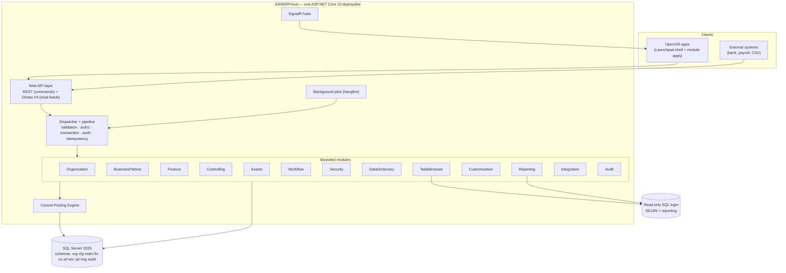
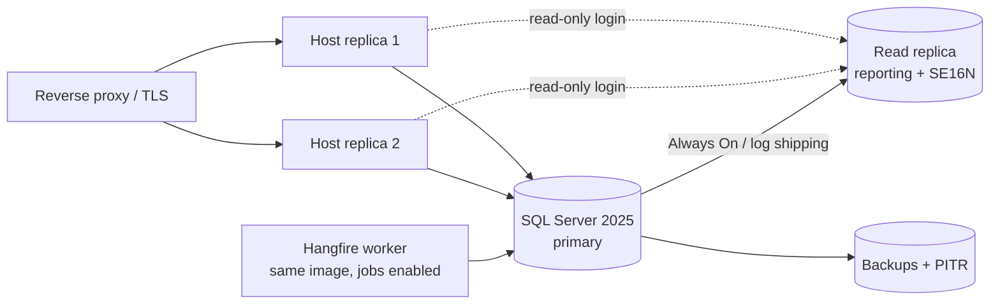

# 01 — Solution Architecture

## 1.1 Shape of the system



<a id="adr-01"></a>
## ADR-01 — Modular monolith, one deployable

**Decision.** All thirteen modules ship in one ASP.NET Core host process against
one database. Boundaries are enforced by assembly references, a published
contract per module, and architecture tests — not by network calls.

**Why.** §22.1 requires that a financial business transaction commits journal
header, lines, open items, controlling entries, asset entries, workflow records
and audit information in one atomic transaction, and rolls the whole operation
back if any mandatory step fails. That is a single-database ACID transaction.
Splitting Finance, Controlling and Assets into separate services would replace
it with a saga plus compensating journal entries, which means a window in which
the ledger is unbalanced and an audit trail full of technical reversals that
never happened in business terms. For a system whose core promise is
"debits equal credits, always", that is the wrong trade.

**Scaling.** Horizontal replicas of the same host behind a load balancer, plus a
read replica for reporting. The posting path is short and transactional; the
expensive work — allocation cycles, depreciation runs, payment runs, report
materialisation — is already asynchronous background work.

**When to revisit.** A genuinely independent context with no transactional
coupling to the ledger — a document-rendering service, an OCR intake service, a
long-running analytics store — can be extracted without touching this decision.
Extracting Finance cannot.

## 1.2 Layers

Each module is internally layered; the layer names match §3.

| Layer | Contains | Depends on |
| --- | --- | --- |
| **Domain** | Entities, value objects, domain services, invariants, domain events | Nothing outside itself |
| **Application** | Commands, queries, handlers, DTOs, validators, port interfaces | Domain, other modules' **contracts** only |
| **Infrastructure** | EF configurations, repositories, external adapters, job definitions | Domain, Application |
| **Api** | Endpoint definitions, request/response mapping, policy names | Application |

Dependencies point inward. Infrastructure is referenced only by the host's
composition root, so no application handler can reach a `DbContext`
implementation type directly.

Cross-cutting layers named in §3 map as follows: *Background Processing* is a
host-level concern that dispatches the same commands as the API; *Reporting* is
a module with read-only access; *Integration* is a module owning inbound and
outbound adapters; *Automated Test* is the `tests/` tree in
[13 — Project Structure](13-project-structure.md).

## 1.3 What "Clean Architecture" costs, and where not to pay it

Clean Architecture is worth its ceremony where behaviour is rich and rules are
contested — posting, valuation, clearing, depreciation, workflow. It is not
worth it for a configuration table with eight columns and no rules beyond
"unique code per tenant".

The rule for this project: **a module may be thin.** `Organization` and
`Customization` will be mostly CRUD over configuration with validation, and
should be written that way — handler, validator, EF configuration, endpoint. No
domain service, no repository interface, no aggregate root, when there is no
invariant to protect. §22.1 says exactly this about repositories: do not create
generic repositories that duplicate `DbSet`. The same restraint applies to every
other pattern in the stack.

Where a repository *is* justified: the journal aggregate (a header and its lines
post as a unit and must never be partially loaded for write), the Business
Partner aggregate (identity plus role facets), and the asset aggregate.

<a id="adr-04"></a>
## ADR-04 — CQRS in-process, no event sourcing

**Decision.** Commands and queries are separate types with separate handlers and
separate models. Both run in-process against the same database. Queries use
`AsNoTracking`, projections and SQL views; commands use tracked aggregates
inside a transaction. There is no event store and no separate read database.

**Why not event sourcing.** The universal journal already *is* an append-only,
immutable, replayable log of every financial fact, with a legally mandated
format. Putting an event store underneath it would create a second append-only
log that has to be reconciled with the first — doubling the reconciliation
surface the design is trying to eliminate. Event sourcing would also make SE16N
and ad-hoc reporting substantially harder, and both are core features here.

**Read models.** Start with SQL views and projections over the journal. Add
materialised summary tables (`rpt.*`) only where a measured report is too slow,
refreshed by a background job with a documented staleness window. Do not build
them speculatively.

<a id="adr-05"></a>
## ADR-05 — No MediatR; use an in-house dispatcher

**Decision.** Do not take a MediatR dependency. Implement a small dispatcher in
`BuildingBlocks.Application`.

**Why.** MediatR 14.2.0 ships under the Reciprocal Public License 1.5, with a
paid commercial licence as the alternative. RPL-1.5 is a strong reciprocal
licence: building a proprietary ERP on it and distributing or hosting it would
oblige source release. This is a licensing decision, not a technical preference,
and it is cheaper to avoid than to unwind after Phase 3.

**Replacement.** Roughly 150 lines:

- `ICommand<TResult>`, `IQuery<TResult>` marker interfaces
- `ICommandHandler<TCommand, TResult>`, `IQueryHandler<TQuery, TResult>`
- `IDispatcher` resolving handlers from the DI container
- An ordered pipeline of `IPipelineBehavior<,>` implementations

The pipeline is where the cross-cutting requirements of §22.1 live, in this
order:

```
CorrelationId → Authorization → Validation → Idempotency
              → TransactionScope → Handler
              → AuditCapture → OutboxDispatch
```

Ordering matters and is part of the design: authorisation before validation so a
user cannot probe field-level rules on data they cannot see; idempotency inside
authorisation so a replayed request is still checked; the transaction opened
after validation so failed validation never starts one; audit capture inside the
transaction so the audit record commits or rolls back with the business data.

## 1.4 Cross-cutting concerns

| Concern | Mechanism | Notes |
| --- | --- | --- |
| Validation | FluentValidation **12.x core** + an endpoint filter | `FluentValidation.AspNetCore` is deprecated; wire it explicitly |
| Errors | Exception middleware → RFC 7807 `ProblemDetails` | Stable `errorCode`, `traceId`, `correlationId`, field-level `errors`; never SQL, stack traces or connection strings |
| Logging | Serilog 10.x, structured, to console + sink | Technical log, **separate** from `audit.*` business history (§22.1) |
| Audit | Pipeline behaviour writing `audit.AuditLog` in the business transaction | Old/new values for config and master data; posted documents immutable |
| Authentication | ASP.NET Core Identity + JWT bearer; OIDC for federated tenants | Service, integration and background user types get non-interactive credentials |
| Authorisation | Policy-based over authorisation objects — see [10](10-security-model.md) | Enforced server-side on every command, query, report and export |
| Concurrency | SQL Server `rowversion` on mutable records; HTTP 409 on conflict | Posted documents are immutable, so no concurrency token applies |
| Background jobs | **Hangfire 1.8.24** | Chosen over Quartz for its persistent job store, dashboard and retry semantics, which suit payment runs and depreciation runs |
| Realtime | SignalR hubs for approval inbox, posting completion, long-job progress | Server-authoritative; the hub pushes notifications, never authorisation state |
| Outbox | `intg.OutboxMessage` written in the business transaction, drained by a job | Required by §22.1 for reliable external publication |
| Idempotency | `fin.PostingIdempotency` unique on (TenantId, IdempotencyKey) | Replay returns the original document number, does not post twice |

<a id="adr-06"></a>
## ADR-06 — OData V4 is scoped, not the backbone

**Decision.** Expose OData V4 for **read-only** collection feeds that benefit
from client-driven query — list reports, worklists, value helps, the table
browser result set, analytical feeds. Every state change goes through a REST
endpoint with an explicit command DTO. Do not expose OData `POST`/`PATCH`/
`DELETE` or `$batch` changesets against the ledger.

**Why.** Two reasons, one technical and one architectural.

The technical one is a live risk: `Microsoft.AspNetCore.OData` has no stable
.NET 10 release. The newest stable is **9.5.0, built for `net8.0`**; the .NET 10
line is at `10.0.0-preview.2`. A `net8.0` package does run on the .NET 10
runtime, so 9.5.0 is usable today, but a preview or a cross-target dependency
sitting on the primary data path of a financial system is a poor bet. Scoping
OData to read feeds means that if the package stalls, the exposure is a
replaceable query surface rather than the whole API.

The architectural one stands regardless of package health: a journal entry is
not a resource `PATCH`. It is a command with preconditions — period open,
balanced, authorised, derivable — that must produce either a posted document or
a precise, field-level rejection. Modelling that as an OData upsert loses the
command's identity, its idempotency key, and its error contract.

**Consequence for UI5.** SAPUI5's `sap.ui.model.odata.v4.ODataModel` binds list
and object pages against the read feeds. Actions are `ODataModel` bound actions
where convenient, otherwise plain `fetch` to the REST command endpoint with the
result folded back into the model. This is a normal Fiori pattern; it is not a
workaround.

**Decision needed at Phase 3 start:** re-check whether
`Microsoft.AspNetCore.OData 10.0.0` has gone stable. If it has, adopt it for the
read feeds. If it has not, ship on 9.5.0 and re-evaluate each quarter.

## 1.5 Frontend architecture

<a id="adr-15"></a>
### ADR-15 — UI5 distribution and version

**Decision.** Pin one UI5 version across all applications, from a maintenance
line rather than the newest release. Build with **UI5 Tooling 4.x**. Serve the
built bundles as static assets from the host, or from a CDN/reverse proxy in
production.

**The licence question that must be answered.** The specification asks for
`sap.ui.comp` smart controls and `sap.viz` charts. **Neither ships in OpenUI5.**
OpenUI5 is Apache-2.0 and contains `sap.m`, `sap.f`, `sap.ui.core`,
`sap.ui.table`, `sap.ui.layout` and friends — but the smart control library and
the visualisation library are SAPUI5-only, and SAPUI5 requires an SAP licence
entitlement.

This is open question 1 in the [index](README.md#open-questions), and it is not
cosmetic:

| If | Then |
| --- | --- |
| SAPUI5 entitlement exists | Use smart filter bars and smart tables for SE16N, list reports and value helps; `sap.viz` for dashboards. Least build effort |
| OpenUI5 only | Build the filter bar, personalisation dialog and variant management as **reusable in-house controls** — roughly one additional Phase 4 workstream — and select an Apache-2.0-compatible chart library for dashboards |

The blueprint assumes **OpenUI5 only** until told otherwise, because that
assumption is the safe one: designing for OpenUI5 and later gaining smart
controls is a simplification, whereas the reverse is a rewrite.

### Application composition

One UI5 **shell** application hosting module applications as components:

```
ui5/
  shell/                 Launchpad-style home: tiles, favourites, recents,
                         approvals, notifications, global search, context bar
  common/                Shared library: reusable controls, formatters,
                         base controller, error handling, auth context,
                         OData model factory, i18n plumbing
  apps/
    org/  bp/  gl/  journal/  ap/  ar/  assets/  co/
    se11/  se16n/  admin/  reports/
```

Every app uses `Component.js` + `manifest.json`, XML views, routing and targets,
resource models, and the device model. Business logic stays out of controllers
(§19); controllers orchestrate, formatters format, and a `common` service layer
talks to the API.

The context bar — company code, fiscal period, language, currency — lives in the
shell and is published on a shared model. Module apps read it and must not
maintain their own copy, otherwise a user switching company code sees stale
data in one tile and fresh data in another.

**Frontend authorisation is navigation only.** Hiding a tile or disabling a
button is a usability affordance. Every action is authorised again on the server
(§22.1), and the server is the only place a denial is authoritative.

### Internationalisation

`i18n.properties` (English) and `i18n_km.properties` (Khmer), with no
user-facing string literals in views or controllers. A lint rule in the UI5
build fails the pipeline on hard-coded text — otherwise the rule erodes within
weeks. Khmer needs a decision on collation and numeral rendering; see open
question 5.

## 1.6 Deployment topology



The Hangfire worker runs the same container image with a flag enabling job
processing, so scheduled work does not compete with request throughput and can
be scaled independently. The read replica is optional at go-live and becomes
worthwhile once reporting volume is measurable — but the **read-only SQL login**
([ADR-14](08-table-browser-se16n.md#adr-14)) applies from day one whether or not
the replica exists.

The container stack already in this repository (`compose.yaml`, the multi-stage
Dockerfile, non-root runtime, health-gated startup, background migrations) is
the development-environment realisation of this topology and carries forward
into Phase 5.
