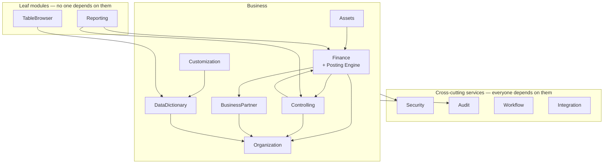

# 02 — Module Boundaries

## 2.1 The thirteen modules

| Module | Owns (schema) | Responsibility | May be called by |
| --- | --- | --- | --- |
| **Organization** | `org`, part of `cfg` | Tenant, company, company code, plant, branch, business area, controlling area, fiscal year and posting period variants, currencies, exchange rates, document types, number ranges | All |
| **BusinessPartner** | `mdm` | BP identity, roles, addresses, banks, relationships, company-code / customer / vendor facets, role synchronisation | Finance, Controlling, Reporting, Integration |
| **Finance** | `fin` | Chart of accounts, G/L, universal journal, AR, AP, open items, clearing, taxes, period close, financial statements. **Owns the posting engine** | Assets, Controlling, Integration, Reporting (read) |
| **Controlling** | `co` | Cost centres, profit centres, internal orders, activity types, statistical key figures, allocation cycles, settlement | Finance (derivation), Reporting |
| **Assets** | `fin` (asset tables) | Asset classes, masters, sub-assets, depreciation areas and keys, acquisition, transfer, retirement, depreciation run | Finance, Reporting |
| **Workflow** | `wf` | Approval rules, instances, steps, delegation, substitution, escalation, notifications | All transactional modules |
| **Security** | `sec` | Users, roles, permissions, authorisation objects and values, sessions, SoD, substitutions | All (as a service) |
| **DataDictionary** | `cfg` (`Dictionary*`) | Domains, data elements, tables, views, search helps, foreign keys, indexes, lock objects, activation | Customization, TableBrowser, Reporting |
| **TableBrowser** | none | Metadata-driven read-only query over authorised tables | — (leaf) |
| **Customization** | `cfg` | Z/Y table designer, ZZ field designer, lifecycle and transport requests | DataDictionary |
| **Reporting** | `rpt` | Report catalogue, layouts, variants, materialised summaries, export | — (leaf) |
| **Integration** | `intg` | Inbound/outbound adapters, webhooks, outbox, import jobs, API keys | All (as a service) |
| **Audit** | `audit` | Business audit history, change documents, retention, tamper detection | All (as a service) |

## 2.2 Dependency rules



Four rules, enforced by architecture tests in CI rather than by convention:

1. **A module references another module's `Contracts` assembly only.** Never its
   `Domain`, `Application` or `Infrastructure`. A contracts assembly holds
   interfaces, DTOs and enums — no behaviour, no EF types.
2. **No module writes to another module's schema.** Reads across schemas go
   through a published view or a contract query; writes go through the owning
   module's application service.
3. **No cycles.** `Finance ↔ Controlling` looks circular because posting derives
   CO objects and CO settlement posts back to FI. It is broken by direction:
   Finance depends on `Controlling.Contracts` for *derivation* (a pure query:
   "is this cost centre valid for this company code on this date?"), and
   Controlling depends on `Finance.Contracts` for *settlement* (issuing a
   posting command). Neither references the other's implementation.
4. **Everything financial posts through the posting engine.** Assets does not
   insert journal lines. Controlling does not insert journal lines. Integration
   does not insert journal lines. They build a posting request and hand it to
   `IPostingEngine`. This is the single most important boundary in the system;
   an architecture test asserts that `fin.JournalEntryLine` is written from
   exactly one assembly.

## 2.3 The module contract

Every module exposes the same shape, so a developer moving between modules finds
the same file in the same place:

```
Modules/<Name>/
  <Name>.Contracts/        Interfaces, DTOs, enums, permission constants,
                           integration event definitions
  <Name>.Domain/           Entities, value objects, domain services, events
  <Name>.Application/      Commands, queries, handlers, validators, ports
  <Name>.Infrastructure/   EF configurations, repositories, adapters, jobs
  <Name>.Api/              Endpoint registrations, request/response models
  <Name>.Tests/            Unit + integration tests for the module
```

and registers itself through one extension method:

```
services.AddFinanceModule(configuration);   // DI, EF configs, jobs, endpoints
```

The host composes modules by calling each `Add<Module>Module`. No module is
referenced by name anywhere except the composition root, which means removing or
replacing one is a compile-time-checkable operation rather than an archaeology
exercise.

## 2.4 Communication between modules

| Style | Use for | Mechanism |
| --- | --- | --- |
| **Direct call via contract** | Synchronous, must be in the same transaction — derivation, validation, posting | Injected contract interface |
| **Domain event, in-process** | Same transaction, same commit — "journal posted" updating open items | Dispatched before commit, handled in the same transaction |
| **Integration event, outbox** | Different transaction or external system — webhook, notification, downstream sync | `intg.OutboxMessage` written in the business transaction, drained by a Hangfire job |

The distinction matters for correctness. A domain event that updates open items
must be inside the posting transaction, or a crash between commit and handler
leaves the ledger and the subledger disagreeing. An integration event notifying
an external bank interface must be *outside* it, or a slow HTTP call holds a
database transaction open across the network — which is exactly the
long-running transaction §22.1 forbids. The outbox pattern is what lets both be
reliable.

## 2.5 Shared building blocks

Code shared by all modules lives in `BuildingBlocks` and is deliberately small.
It is a place for mechanisms, not for business concepts.

| Assembly | Contains |
| --- | --- |
| `BuildingBlocks.Domain` | `Entity`, `AggregateRoot`, `ValueObject`, `IDomainEvent`, `Money`, `Quantity`, `DateRange`, `TenantId` |
| `BuildingBlocks.Application` | Dispatcher, `ICommand`/`IQuery`, pipeline behaviours, `IUserContext`, `ITenantContext`, `IClock` |
| `BuildingBlocks.Infrastructure` | `DbContext` base with tenant filter and audit interception, outbox, Hangfire wiring, `rowversion` conventions |
| `BuildingBlocks.Api` | ProblemDetails mapping, pagination contract, correlation middleware, endpoint conventions |

The risk with a shared kernel is that it becomes the place where anything
awkward gets dumped, and then every module depends on everything. The guard:
**nothing enters `BuildingBlocks` until at least three modules need it**, and
nothing with a business rule in it enters at all. `Money` belongs there;
`ReconciliationAccount` does not.
