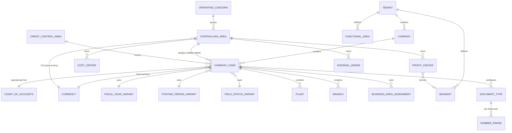

# 03 — Enterprise Structure

## 3.1 The object model



## 3.2 Object catalogue

| Object | Key | Level | Purpose |
| --- | --- | --- | --- |
| Tenant | `TenantId` | root | Isolation boundary. Every table carries it |
| Company | Tenant + Code | legal group | Consolidation unit, groups company codes |
| Company Code | Tenant + Code (4 char) | **legal entity** | Smallest unit producing a complete set of statutory accounts. The primary posting dimension |
| Business Area | Tenant + Code | cross-company | Optional internal reporting dimension |
| Plant / Branch / Location | Tenant + Code | operational | Below company code; logistics and local reporting |
| Department | Tenant + Code | organisational | Reporting and workflow routing |
| Sales Org / Purchasing Org | Tenant + Code | operational | Present now so BP sales and purchasing facets have a home |
| Chart of Accounts | Tenant + Code | shared | Account catalogue. **Shareable across company codes** |
| Fiscal Year Variant | Tenant + Code | shared | Period count, special periods, year shift |
| Posting Period Variant | Tenant + Code | shared | Which periods are open, per account type |
| Field Status Variant | Tenant + Code | shared | Field suppression / required / optional per group |
| Controlling Area | Tenant + Code | CO | Cost accounting boundary; groups compatible company codes |
| Operating Concern | Tenant + Code | CO-PA | Reserved for profitability analysis |
| Credit Control Area | Tenant + Code | AR | Credit limit boundary |
| Functional Area | Tenant + Code | reporting | Cost-of-sales reporting |
| Segment | Tenant + Code | reporting | IFRS 8 segment; derivable from profit centre |
| Profit Centre / Cost Centre hierarchy | Tenant + Area + Code | CO | Standard hierarchy with validity |
| Currency | ISO code | global | Decimals per ISO 4217 |
| Exchange Rate Type | Tenant + Code | global | M, B, G, P… with quotation direction |
| Tax Jurisdiction / Tax Code | Tenant + Country + Code | tax | Rates, accounts, deductibility |

## 3.3 Assignment rules

The rules in §4 restated as enforceable constraints. Each has a stated
enforcement point, because "the system prevents it" is only true if something
specific does the preventing.

| # | Rule | Enforced by |
| --- | --- | --- |
| R1 | A tenant contains many companies | FK + tenant filter |
| R2 | A company contains many company codes | FK |
| R3 | Every company code has exactly one local currency and one operational chart of accounts | `NOT NULL` FKs, set at creation, **immutable once any document is posted** |
| R4 | Many company codes may share one chart of accounts | FK, no unique constraint |
| R5 | A controlling area may span several company codes, but only *compatible* ones | Domain service `ControllingAreaCompatibility` — see below |
| R6 | Cost centres, profit centres and internal orders belong to one controlling area | FK, composite key includes area |
| R7 | Plants and branches belong to one company code | FK |
| R8 | Assignments are validity-dated | `ValidFrom` / `ValidTo` on assignment tables, with an overlap-exclusion check |
| R9 | Incompatible assignments are rejected | Validation in the application layer, mirrored by check constraints where expressible |

### R5 — controlling area compatibility

Company codes may share a controlling area only when:

- they use the **same operational chart of accounts**, and
- they use the **same fiscal year variant** (period count and boundaries must
  agree, or cross-company CO postings cannot be assigned to a period), and
- cross-company-code cost accounting is explicitly switched on for the area, and
- currency handling is consistent: the controlling area currency is either the
  common local currency of all assigned company codes, or an explicit CO area
  currency with translation configured.

Violating any of these produces a validation error naming the specific
mismatch — not a generic "incompatible assignment", which is the failure mode
that makes configuration miserable to debug.

### R8 — validity dating and overlap

Every assignment table carries `ValidFrom` and `ValidTo` (`ValidTo` exclusive,
open-ended stored as `9999-12-31`). Two guards:

- **No overlap** for the same assignment pair — enforced by application check
  and, where the pattern allows, a filtered unique index on the open-ended row.
- **No orphan period** — a posting date must fall inside a valid assignment, and
  the posting engine validates this at derivation time rather than trusting that
  configuration was maintained.

Historical assignments are never deleted; a superseded assignment keeps its
`ValidTo` so old documents still resolve their organisational context. This is
what makes a three-year-old trial balance reproducible after a reorganisation.

## 3.4 Immutability of structural configuration

Some configuration is safe to change forever; some becomes locked the moment it
has been used. Getting this wrong is one of the most common ways an ERP
implementation corrupts its own history.

| Change | Allowed after first posting? | Reasoning |
| --- | --- | --- |
| Company code description, address | Yes | Descriptive only |
| Company code local currency | **No** | Every posted local amount was computed against it |
| Company code chart of accounts | **No** | Every posted account reference resolves through it |
| Fiscal year variant | **No** | Period boundaries of posted documents would move |
| Adding a new document type / number range | Yes | Additive |
| Changing a number range interval already consumed | **No** | Would produce duplicate document numbers |
| Adding a company code to a controlling area | Yes, with a validity date in an open period | Prospective only |
| Removing a company code from a controlling area | Only by ending validity; never by deletion | Historical CO postings must still resolve |
| Opening / closing posting periods | Yes | That is their purpose |
| Deactivating a cost centre | Yes, by setting `ValidTo` | Blocks new postings, preserves history |

The rule that generalises these: **configuration that participated in the
computation of a posted amount is frozen.** The implementation is a
`IStructuralChangeGuard` consulted by the Organization module, which asks
Finance whether any document exists for the object in question. That is a
cross-module contract call, which is why `Organization` sits below `Finance` in
the dependency graph but is queried by it — the guard interface is defined in
`Organization.Contracts` and implemented in `Finance.Infrastructure`.

## 3.5 Fiscal calendar and posting periods

`FiscalYearVariant` defines how many normal periods (typically 12) and special
periods (typically 4, for year-end adjustments) a year has, and whether the
fiscal year is shifted relative to the calendar year.

`PostingPeriodVariant` controls what is open, and it must be controllable
**per account type** — a period is frequently closed for AR and AP while still
open for G/L so the accounting team can post adjustments. The open-period record
therefore keys on (variant, account type, fiscal year, period) and carries two
ranges: a normal range for all users and a second range restricted by
authorisation group for the closing team.

Period determination at posting time: the posting date plus the fiscal year
variant yields (fiscal year, period). The posting engine never accepts a period
supplied by the client; it derives it and rejects the document if the derived
period is closed for the relevant account type. Accepting a client-supplied
period is how backdated postings get into closed periods.

## 3.6 Sample structure for Phase 2 seed data

Matching §24, so the seed is fixed now rather than invented later:

```
Tenant  KSS
├── Company 1000 "KSS Group"
│   ├── Company Code 1000  KSS Cambodia    local USD   CoA INT   FYV K4
│   └── Company Code 1100  KSS Kampot      local USD   CoA INT   FYV K4
└── Company 2000 "KSS Thailand Holding"
    └── Company Code 2000  KSS Thailand    local THB   CoA INT   FYV K4

Chart of Accounts  INT      shared by all three company codes
Controlling Area   CA01     currency USD, cross-company on, CCs 1000/1100/2000
Group currency     USD
Transaction currencies  USD, KHR, THB
Credit Control Area CC01    covers 1000, 1100
```

Company code 2000 has a THB local currency but sits in a USD controlling
area — deliberately, so that cross-company CO postings and currency translation
are exercised by the seed rather than discovered in production. The intercompany
pair (1000 ↔ 2000) gives the intercompany process something real to post
against.
