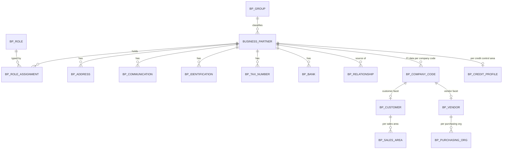
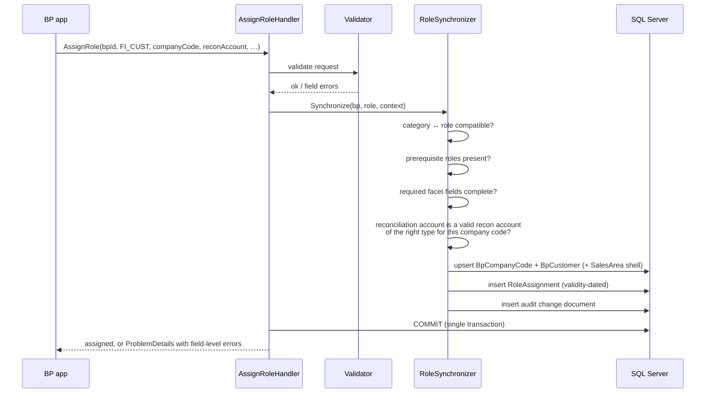

# 04 — Business Partner

## 4.1 The core idea

### ADR-10 — One identity, many role facets

**Decision.** `mdm.BusinessPartner` is the only identity. "Customer" and
"Vendor" are **roles** a partner holds, and the customer-specific and
vendor-specific data are child facets of that same partner. There is no separate
customer master and no separate vendor master. A partner who is both — common in
sugar, agriculture and trading, where the same counterparty supplies cane and
buys refined product — is one row with two roles, not two rows to be reconciled.

**Synchronisation is synchronous and in the same transaction.** Assigning a role
creates or updates the required role-specific records as part of the same unit
of work, and fails the whole operation if the required data is incomplete or
invalid.

**Why not SAP's asynchronous CVI approach.** SAP's Customer/Vendor Integration
grew out of merging two legacy masters (KNA1/LFA1) into BP, and it synchronises
asynchronously through a queue. That produces a well-known class of support
incident: BP created, sync queue stuck, customer master missing, invoice fails
at posting with an error that names neither the BP nor the queue. There is no
legacy master to merge here, so the coupling can simply be direct and
transactional. Either the partner has a valid, complete customer facet after the
command commits, or the command failed and said why.

## 4.2 Entity model

The sixteen tables from §6, with the level each one lives at — the level is the
part that determines whether data is shared or company-specific, and it is the
part most often got wrong:

| Table | Level | Notes |
| --- | --- | --- |
| `mdm.BusinessPartner` | client | Identity, category, group, names, search terms, language, status, validity |
| `mdm.BusinessPartnerRole` | client | Catalogue of roles (configuration, not master data) |
| `mdm.BusinessPartnerRoleAssignment` | BP | Validity-dated. The join that makes a partner a customer |
| `mdm.BusinessPartnerGroup` | client | Grouping / account group, drives number range and field status |
| `mdm.BusinessPartnerIdentification` | BP | ID cards, registration numbers, licences |
| `mdm.BusinessPartnerAddress` | BP | Multiple, typed, validity-dated, one default per type |
| `mdm.BusinessPartnerCommunication` | BP address | Phone, email, fax — attached to an address, not floating |
| `mdm.BusinessPartnerBank` | BP | Bank key, account, IBAN/SWIFT, holder, validity |
| `mdm.BusinessPartnerTaxNumber` | BP | Per country and tax type; VAT/TIN |
| `mdm.BusinessPartnerRelationship` | BP↔BP | Validity-dated, typed, directional |
| `mdm.BusinessPartnerCompanyCode` | BP + company code | Reconciliation accounts, payment terms and methods, dunning, tolerance, withholding tax, blocks, correspondence |
| `mdm.BusinessPartnerCustomer` | BP + company code | Customer account group and number, AR-specific settings |
| `mdm.BusinessPartnerVendor` | BP + company code | Vendor account group and number, AP-specific settings |
| `mdm.BusinessPartnerSalesArea` | BP + sales area | Distribution channel, division, pricing, shipping, classification |
| `mdm.BusinessPartnerPurchasingOrganization` | BP + purch. org | Order currency, Incoterms, terms, GR/IV settings |
| `mdm.BusinessPartnerCreditProfile` | BP + credit control area | Limit, exposure, risk class, review date |

Two placement notes worth settling now:

**Communication hangs off the address, not the partner.** A partner with a head
office and three plants has a different phone number per site. Attaching
communication directly to the partner forces a fiction of one contact channel
per company.

**The credit profile is per credit control area, not per company code.** A
credit limit that spans two company codes in the same control area is the whole
point of the object; keying it by company code would silently double the
customer's effective limit.

## 4.3 Roles

| Role | Code | Requires | Creates on assignment |
| --- | --- | --- | --- |
| General Business Partner | `BP_GEN` | Name, category, group | — (always present) |
| Customer | `CUST` | Sales area | `BusinessPartnerSalesArea` shell |
| FI Customer | `FI_CUST` | Company code, **reconciliation account** | `BusinessPartnerCompanyCode` + `BusinessPartnerCustomer` |
| Vendor / Supplier | `VEND` | Purchasing organisation | `BusinessPartnerPurchasingOrganization` shell |
| FI Vendor / Supplier | `FI_VEND` | Company code, **reconciliation account** | `BusinessPartnerCompanyCode` + `BusinessPartnerVendor` |
| Employee | `EMPL` | Person category | Link to `sec.User` if applicable |
| Contact Person | `CONT` | Person category, a relationship to an organisation | — |
| Bank | `BANK` | Organisation category, bank key | — |
| Intercompany Partner | `ICOM` | Link to a company code in the same tenant | Marks the partner for elimination |

Constraints that fall out of the role model:

- The `Person` category cannot hold `BANK`. The `Group` category cannot hold
  `EMPL` or `CONT`. Category-role compatibility is a configuration table, not
  hard-coded, because it varies by customer.
- `FI_CUST` requires `CUST`; `FI_VEND` requires `VEND`. The FI facet is a
  refinement, not an alternative.
- `ICOM` requires that the referenced company code exists in the same tenant,
  and that the partner is not also `EMPL`.
- Roles are **validity-dated**. A partner can be a vendor until March and a
  customer from April, and documents in each period resolve the role that was
  valid then.

## 4.4 The synchronisation service

`IBusinessPartnerRoleSynchronizer` runs inside the command transaction:

### Rules the synchroniser enforces

| Rule | Behaviour on violation |
| --- | --- |
| Reconciliation account must exist in the company code's chart of accounts, be flagged as a reconciliation account, and its type must match the role (`D` for customer, `K` for vendor) | Reject with the account and its actual type named |
| A role cannot be removed while **open items exist** for that partner and role | Reject, listing the open item count and company codes |
| A role cannot be removed while unposted documents reference it | Reject |
| Reconciliation account cannot be changed once postings exist | Reject; direct the user to the adjustment procedure — the old account carries a balance that must be transferred by a posting, not by editing master data |
| Payment block, posting block and deletion flag propagate to the facet, never the reverse | Silent, by design — the partner is the master |
| Number assignment: one BP number range per BP group; customer and vendor account numbers default to the BP number ("same number" mode) unless the group configures separate ranges | Configuration, defaulted to same-number |

The open-items guard is the one that matters most in practice. Without it, a
user tidying up master data can orphan a subledger balance that no report will
then explain.

## 4.5 Duplicate prevention

Duplicated partners are the standard failure of BP master data, and they are
expensive: two partners means two balances, two credit exposures and two
dunning runs for one counterparty.

- **Hard constraints:** unique tax number per (country, tax type); unique
  registration number per country; unique bank account per (bank key, account).
- **Soft check** at creation and on change, returning candidates rather than
  blocking: normalised name similarity, matching address, matching phone or
  email domain. The user must acknowledge the candidate list before proceeding,
  and the acknowledgement is audited so a later duplicate has an owner.
- `BP_CHECK` (§9) runs the same soft check in bulk over existing data for
  periodic cleansing.

## 4.6 Screen design

The BP application uses `sap.f.DynamicPage` with `sap.m.IconTabBar` and the
tabs required by §6, rendered from **reusable XML fragments** so the same
address fragment serves the BP app, the customer facet and the vendor facet:

| Tab | Visible when | Editable when |
| --- | --- | --- |
| General | always | `BP_GEN` change authority |
| Addresses / Communication | always | as above |
| Identification / Tax | always | as above |
| Banks | always | bank-detail authority (separately authorised — bank data is a fraud target) |
| Relationships | always | as above |
| Company Code | `FI_CUST` or `FI_VEND` held | per company code authority |
| Customer | `CUST` held | AR master authority |
| Vendor | `VEND` held | AP master authority |
| Sales Area | `CUST` held | AR master authority |
| Purchasing Org | `VEND` held | AP master authority |
| Credit Management | `FI_CUST` held | credit manager role only |
| Attachments | always | attachment authority |
| Change History | always | read-only, always |

Tabs are hidden when the role is absent — a usability affordance only. The
server authorises each facet independently, so hiding the Banks tab is not what
protects bank details.

**Maker-checker on bank data.** Changing a vendor bank account is the highest-
risk master data change in an ERP; it is the mechanism of invoice redirection
fraud. Bank detail changes route through workflow approval by default, and the
approver cannot be the maker. This is configuration, but it ships switched on.

## 4.7 T-codes

| T-code | Function |
| --- | --- |
| `BP` | Maintain business partner (all roles, single screen) |
| `BUP1` / `BUP2` / `BUP3` | Create / change / display |
| `BP_ROLE` | Role catalogue and category-role compatibility configuration |
| `BP_SYNC` | Synchronisation status, re-run consistency check for a partner or a selection |
| `BP_CHECK` | Bulk duplicate and completeness analysis |

`BP_SYNC` exists even though synchronisation is transactional: it is the tool
for verifying that data migrated from a legacy system satisfies the same
invariants that the runtime enforces. Migration is where inconsistency actually
enters the system.
