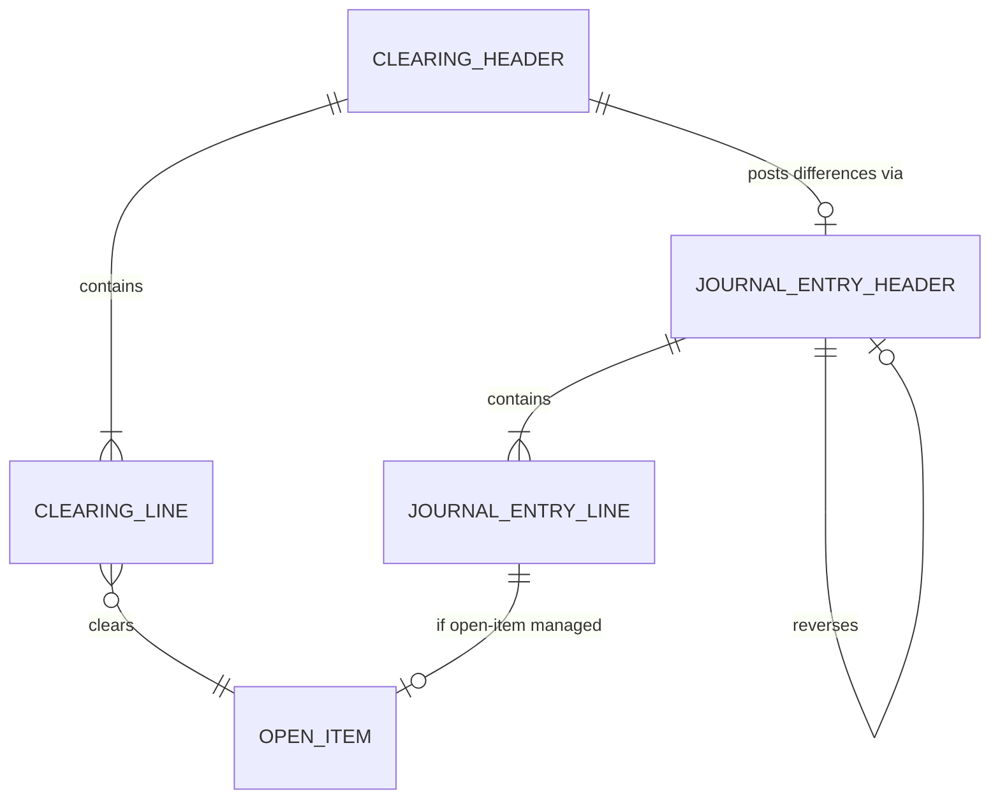
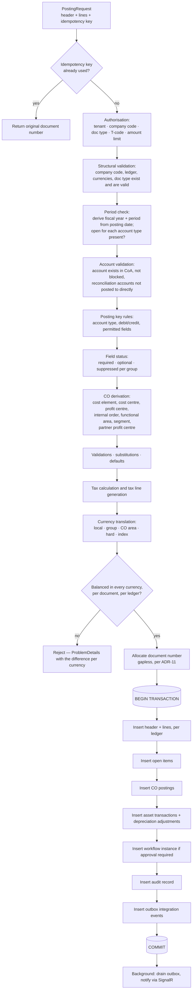

# 05 — Universal Journal, Currency and Posting

This is the core of the system. Every other module either feeds it or reads it.

## ADR-07 — One wide, insert-only journal line table

**Decision.** `fin.JournalEntryLine` carries every reporting dimension and every
currency amount on each line. It is insert-only and partitioned by fiscal year.
AR, AP, Asset Accounting and Controlling are **projections** of it.

**Why.** The alternative — a slim G/L table plus separate subledger tables that
each hold their own amounts — is the design that creates the reconciliation
problem that §23 then demands tests for. If the AR balance is *derived from* the
journal rather than *maintained alongside* it, "subledger reconciles to G/L"
stops being a nightly job that can fail and becomes an invariant that cannot.

The cost is a wide table with many nullable columns. That is a real cost, and it
is the right one to pay: it is paid in storage, which is cheap, rather than in
correctness, which is not.

**Insert-only.** No `UPDATE`, no `DELETE`, ever, on a posted line. Corrections
are reversals or adjustment postings (§13). This is enforced three ways: no
update path exists in the code, an architecture test asserts it, and the
application's SQL principal is denied `UPDATE`/`DELETE` on the table with
changes routed through a stored procedure that only inserts.

## 5.1 Header — `fin.JournalEntryHeader`

| Group | Fields |
| --- | --- |
| Identity | `TenantId`, `CompanyCodeId`, `FiscalYear`, `DocumentNumber` (business key); `Id` surrogate |
| Ledger | `LedgerId` — the accounting standard this document belongs to |
| Type | `DocumentTypeId`, `SourceModule`, `TransactionCode` |
| Dates | `DocumentDate`, `PostingDate`, `EntryDateUtc`, `FiscalPeriod` (derived, never client-supplied), `TranslationDate` |
| Currency | `DocumentCurrencyId`, `ExchangeRateType`, `ExchangeRateToLocal`, `ExchangeRateToGroup` |
| Description | `Reference`, `HeaderText` |
| Lifecycle | `Status`, `ReversalOfDocumentNumber`, `ReversedByDocumentNumber`, `ReversalReasonId` |
| Control | `IdempotencyKey`, `CorrelationId` |
| Audit | `CreatedBy`, `CreatedAtUtc`, `PostedBy`, `PostedAtUtc` |

`Status` is mutable **only** while the document is pre-posting
(`Draft → Held → Parked → Submitted → PendingApproval → Approved`). Once
`Posted`, the only permitted transition is the *setting of*
`ReversedByDocumentNumber` when a reversal is posted — a single forward-only
link, written once. Everything else about the document is frozen.

Pre-posting documents are genuinely mutable and carry a `rowversion` for
optimistic concurrency. Posted documents have no concurrency token because they
have no update path.

## 5.2 Line — `fin.JournalEntryLine`

| Group | Fields |
| --- | --- |
| Key | `TenantId`, `CompanyCodeId`, `FiscalYear`, `DocumentNumber`, `LineNumber` |
| Ledger | `LedgerId` |
| Posting | `PostingKey`, `DebitCreditIndicator`, `AccountType` (`S` G/L, `D` customer, `K` vendor, `A` asset, `M` material) |
| Account | `GLAccountId` |
| Partner | `BusinessPartnerId`, `BusinessPartnerRole` |
| Asset | `AssetId`, `AssetSubNumber`, `AssetTransactionType` |
| Controlling | `CostCenterId`, `ProfitCenterId`, `InternalOrderId`, `ActivityTypeId`, `CostElementId` |
| Reporting | `BusinessAreaId`, `FunctionalAreaId`, `SegmentId`, `PlantId`, `BranchId` |
| Intercompany | `PartnerCompanyCodeId`, `PartnerProfitCenterId`, `PartnerSegmentId` |
| **Amounts** | `DocumentAmount`, `LocalAmount`, `GroupAmount`, `ControllingAreaAmount`, `HardCurrencyAmount`, `IndexCurrencyAmount` — each `decimal(19,4)` with its `…CurrencyId` |
| Quantity | `Quantity` `decimal(23,6)`, `UnitOfMeasureId` |
| Tax | `TaxCodeId`, `TaxBaseAmount`, `TaxAmount`, `TaxJurisdictionId`, `IsTaxLine` |
| Payment | `DueDate`, `PaymentTermsId`, `PaymentMethod`, `PaymentBlockId`, `BaselineDate` |
| Text | `Assignment`, `Reference1`, `Reference2`, `Reference3`, `LineText` |
| Source | `SourceModule`, `SourceDocumentType`, `SourceDocumentNumber`, `SourceLineNumber` |
| Extension | `ZZ*` typed columns generated by the customisation framework — see [09](09-custom-objects.md) |

Note what is **not** on the line: no `ClearingDocument`, no `ClearingDate`, no
`ClearingStatus`, no `IsCleared`. That is ADR-09.

## ADR-08 — Currency amounts as named columns

**Decision.** Each required currency is a named column pair
(`XxxAmount`, `XxxCurrencyId`), not a row in an amounts child table.

**Why.** The alternative — one row per (line, currency type) — normalises
prettily and then makes every financial query a pivot. A trial balance in group
currency becomes a self-join or a conditional aggregate over a table six times
the row count of the journal. Named columns keep the common reporting queries
flat, let indexes include the amounts they need, and make the balanced-document
check a simple `SUM` per currency. Six nullable decimal columns is a small price.

The six currency types from §5 map as:

| Type | Column | Source |
| --- | --- | --- |
| Document (transaction) | `DocumentAmount` | As entered |
| Local (company code) | `LocalAmount` | Translated at the document's rate; **always populated** |
| Group | `GroupAmount` | Translated to the group currency for consolidation |
| Controlling area | `ControllingAreaAmount` | Populated when the line carries a CO object |
| Hard | `HardCurrencyAmount` | Optional, for high-inflation jurisdictions |
| Index-based | `IndexCurrencyAmount` | Optional, for indexed reporting |

Reporting currency is *not* a stored column — it is a translation applied at
report time from local or group amounts, at the rate type and date the report
requests. Storing it would freeze a reporting choice into the ledger.

### Precision, and where rounding is decided

Per §1: amounts `decimal(19,4)`, quantities and exchange rates `decimal(23,6)`.
Timestamps stored UTC, displayed in the user's zone.

Rounding rules that must be settled before Phase 2 writes the translation
service:

- Translate **per line**, then verify the document balances in every currency.
  Translating the document total and distributing it is faster and produces
  lines that do not foot.
- Line-level rounding differences that leave a currency unbalanced are absorbed
  into a configured **rounding difference account**, on a generated line, never
  by silently adjusting a business line.
- Currency decimal places come from the currency master (KHR has none in
  practice; JPY has none; most have two), and display truncation must never be
  confused with stored precision. Store four decimals always; display per
  currency.

## ADR-09 — Clearing lives in `fin.OpenItem`

**Decision.** A posted journal line is never updated to record that it has been
cleared. Open-item state lives in `fin.OpenItem`, one row per open-item-managed
journal line, and clearing updates that row.

**Why.** §13 says posted documents are never deleted or directly changed, and
§23 makes it a mandatory test. SAP itself violates the spirit of this by
updating clearing fields in `BSEG`. Since the requirement here is explicit,
resolve it properly: the journal is the immutable record of what was posted; the
open-item table is the mutable record of what remains outstanding. Both are
derived from the same posting transaction, and the open-item table's balance is
reconcilable to the journal at any moment.

`fin.OpenItem` carries: the journal line key, `BusinessPartnerId` and role or
`GLAccountId`, original and open amounts in document/local/group currency,
`DueDate`, `PaymentTerms`, `DunningLevel`, `DunningDate`, `ClearingStatus`
(`Open` / `PartiallyCleared` / `Cleared`), `ClearingDocument`, `ClearingDate`,
and a `rowversion`. Partial and residual payments reduce the open amount;
residual payments additionally post a new open item for the remainder.

An open item is only ever created for accounts flagged as open-item managed —
reconciliation accounts, bank clearing accounts, and G/L accounts configured for
it. Ordinary expense accounts get no open item.

## 5.3 Ledgers and parallel accounting

`LedgerId` on both header and line supports parallel accounting standards
(IFRS plus one or more local GAAPs). The design:

- One **leading ledger**, the basis for the local statutory close.
- Zero or more **non-leading ledgers**, each tied to an accounting standard and
  optionally to a different fiscal year variant.
- Postings that are identical under all standards are written **once per
  ledger** by the posting engine, so a ledger's trial balance is complete on its
  own without an "all ledgers plus deltas" reading.
- Valuation differences (depreciation area differences, currency valuation,
  provisions) post to a single ledger only.

Writing each posting to every ledger multiplies journal rows by the ledger
count. That is deliberate: the alternative — a base ledger plus delta ledgers —
makes every report a union with sign handling, and makes an auditor's
"show me the IFRS trial balance" a computation rather than a query.

Open question 4 in the [index](README.md#open-questions) asks how many ledgers
are live at go-live, because it changes both storage sizing and the depreciation
area design.

## 5.4 Central posting engine

Every financial posting in the system, from any module, enters here.

### Simulation

`Simulate` runs the identical pipeline up to and including the balance check,
then returns the complete derived result — every line with its derived CO
objects, generated tax lines, all currency amounts, and the resulting account
balances — **without** allocating a document number and without opening a
transaction. Simulation and posting must share one code path; a simulation that
runs different code is a simulation of the wrong thing.

### Idempotency

`fin.PostingIdempotency`: unique index on (`TenantId`, `IdempotencyKey`),
storing the resulting company code, fiscal year and document number. A retried
request with the same key returns the original document rather than posting a
second one. The key comes from the client for API callers and from the
correlation ID for internal callers. Required by §22.1 and it is the only thing
standing between a flaky network and a duplicated payment run.

## ADR-11 — Gapless document numbering, and what it costs

**Decision.** Document numbers are gapless within
(tenant, company code, fiscal year, document type), which requires serialised
allocation. Format is configurable, e.g. `KSS-2026-SA-0000000123`.

**Why this needs a decision, not a default.** Many jurisdictions require
sequential, gapless numbering of tax documents; auditors treat a gap as an
allegation of a deleted invoice. But gaplessness and throughput are directly
opposed:

| Approach | Gapless | Concurrency | Mechanism |
| --- | --- | --- | --- |
| SQL `SEQUENCE` | No — caches and loses numbers on restart | Excellent | `NEXT VALUE FOR` |
| Row counter, own transaction | No — a rolled-back posting burns a number | Good | Update, commit, then post |
| **Row counter, posting transaction** | **Yes** | Serialised per range | `UPDATE … WITH (UPDLOCK, ROWLOCK) … OUTPUT inserted.Current` |

The third is chosen. Consequences, stated plainly so they are not discovered
later:

- Concurrent postings **to the same document type in the same company code and
  year** serialise behind one row lock. Different document types, company codes
  or years proceed in parallel, so the practical throughput ceiling is per
  range, not global.
- The number is allocated **last**, immediately before the inserts, to hold the
  lock for the shortest possible time. Every validation, derivation and
  translation happens before the lock is taken.
- A rollback after allocation would create a gap, so nothing that can fail is
  permitted between allocation and commit.
- `cfg.NumberRangeGap` records any gap detected by the monitoring job, with the
  reason, so an auditor's question has an answer.

If some document types do not require gaplessness — internal statistical
postings, for example — they can be configured onto a sequence-backed range and
avoid the serialisation entirely. That configuration flag exists per range from
the start; open question 3 decides which ranges use it.

## 5.5 Reversal

Reversal posts a **new** document that mirrors the original with opposite
debit/credit indicators, links both directions, and reopens or reverses the
clearing of any affected open items.

| Rule | Reasoning |
| --- | --- |
| Reversal date defaults to the original posting date; if that period is closed, the current open period is used and the difference is flagged | Preserves period integrity without blocking the correction |
| A document already reversed cannot be reversed again | The link is single-valued |
| A reversal cannot itself be reversed — post the original again instead | Prevents unbounded reversal chains that no report can follow |
| Cleared items must be reset before their document is reversed | Otherwise clearing references a document that no longer nets |
| A reversal reason is mandatory and recorded | Audit requirement |

## 5.6 Reconciliation guarantees

Because the subledgers are projections rather than parallel records, the §23
reconciliation tests assert derivability rather than agreement:

| Test | Assertion |
| --- | --- |
| Debits equal credits | Per document, per ledger, per currency, `SUM` is zero |
| AR reconciles to G/L | `SUM(OpenItem)` by reconciliation account equals the journal balance for that account |
| AP reconciles to G/L | Same, vendor side |
| Assets reconcile to G/L | Asset transaction values equal journal balance on the asset reconciliation accounts |
| CO reconciles to FI | CO postings equal journal lines carrying a CO object, per period |
| Currency reconciles | Local and group totals equal the sum of per-line translations, differences confined to the rounding account |
| Closed period rejects postings | Posting into a closed period fails with a specific error, for every account type |
| Posted documents are immutable | No code path, and no SQL permission, updates a posted line |
| Reversals reference originals | Every reversal has a resolvable `ReversalOfDocumentNumber` |
