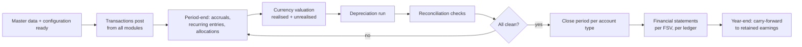
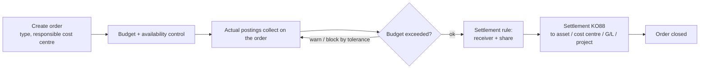

# 06 — Business Processes

Seven processes from §16. Each is given prerequisites, the posting it produces,
statuses, and what can go wrong — because the error paths are where an ERP
implementation actually lives.

Notation for entries: `Dr` debit, `Cr` credit, account type in brackets.

## 6.1 Record to Report

The umbrella process: everything posts to the universal journal, and the close
turns it into statements.



Period close sequence, and it is a sequence — closing sub-ledgers before the
G/L, and the G/L before the year:

1. Block new postings for AR/AP by closing those account types.
2. Run recurring entries and accruals; reverse prior-period accruals.
3. Run allocation cycles (distribution, then assessment).
4. Run foreign currency valuation for open items and balances.
5. Run depreciation.
6. Run reconciliation reports; investigate before continuing.
7. Close remaining account types.
8. Produce statements per financial statement version and ledger.
9. At year end, carry balances forward and post P&L to retained earnings.

## 6.2 Customer invoice and receipt (Order to Cash, FI scope)

**Prerequisites.** BP with `CUST` + `FI_CUST` roles in the company code;
reconciliation account of type `D`; revenue accounts; tax codes; credit profile
if credit management is active.

**Customer invoice**

```
Dr  Customer (D)  BP recon account          1,100
    Cr  Revenue (S)                            1,000
    Cr  Output VAT (S)                           100
```

The customer line creates an open item with a due date derived from the baseline
date and payment terms. The revenue line carries profit centre and segment.

**Credit check.** Before posting, exposure (open items + this document) is
compared to the credit limit for the credit control area. Over-limit behaviour
is configurable per customer: warn, block for approval, or reject.

**Incoming payment (F-28)**

```
Dr  Bank / bank clearing (S)                 1,100
    Cr  Customer (D)                            1,100
```

then clearing against the open invoice. Three settlement shapes:

| Shape | Result |
| --- | --- |
| Full | Invoice open item → `Cleared` |
| Partial | Open amount reduced; item stays `PartiallyCleared`; no new item |
| Residual | Original item `Cleared`; **new** open item posted for the remainder with a new baseline date |
| On account | Payment posted with no allocation; creates its own open item on the customer |

Underpayments within a configured tolerance post the difference to a payment
difference account rather than leaving a residual.

**Statuses.** `Draft → Parked → Submitted → PendingApproval → Posted → PartiallyCleared → Cleared`, with `Reversed` reachable from `Posted`.

**Failure modes worth designing for:** period closed for account type `D`;
customer blocked for posting; reconciliation account changed mid-period;
withholding tax configured but no base amount; payment received in a currency
other than the invoice, producing a realised exchange difference that must post
to the configured gain/loss account.

## 6.3 Vendor invoice and payment (Procure to Pay, FI scope)

**Prerequisites.** BP with `VEND` + `FI_VEND`; reconciliation account type `K`;
expense or asset accounts; tax codes; withholding tax configuration where
applicable; bank master and payment methods.

**Vendor invoice**

```
Dr  Expense / Asset (S/A)                    1,000
Dr  Input VAT (S)                              100
    Cr  Vendor (K)                              1,100
```

With withholding tax at, say, 15% on services:

```
Dr  Expense (S)                              1,000
Dr  Input VAT (S)                              100
    Cr  Vendor (K)                                950
    Cr  Withholding tax payable (S)               150
```

The expense line carries cost centre or internal order; CO derivation happens in
the posting engine, not in the AP screen.

**Payment run (F110)** is a four-stage process, and each stage is separately
restartable because payment runs fail in the middle:

1. **Proposal** — select due open items by company code, payment method, due
   date, currency; group by payee and bank.
2. **Edit proposal** — block, unblock, change house bank, split.
3. **Payment posting** — one document per payee group:
   ```
   Dr  Vendor (K)                              1,100
       Cr  Bank clearing (S)                      1,100
   ```
   and clearing of the selected open items.
4. **Bank file generation** — outbound file to the house bank; the clearing
   account is settled when the bank statement is imported.

The payment run is a Hangfire job carrying the idempotency key of the proposal,
so a retry after a network failure cannot pay twice.

## 6.4 Asset lifecycle

**Prerequisites.** Asset class with number range, account determination and
depreciation areas; depreciation keys; useful life defaults.

| Event | Entry |
| --- | --- |
| Acquisition from vendor | `Dr Asset (A)` / `Cr Vendor (K)` — one document, both subledgers |
| Acquisition via clearing | `Dr Asset (A)` / `Cr Asset acquisition clearing (S)` |
| Assets under construction | Post to AuC, then settle to the final asset |
| Depreciation run (AFAB) | `Dr Depreciation expense (S)` / `Cr Accumulated depreciation (S)`, per area, per period |
| Transfer | Retire from the sending asset, acquire on the receiving asset, in one document |
| Retirement — scrapping | `Dr Accum. depreciation (S)` + `Dr Loss on disposal (S)` / `Cr Asset (A)` |
| Retirement — sale | Add `Dr Customer/Bank` and gain or loss on the difference to net book value |
| Write-up / unplanned depreciation / impairment | Value adjustment in the affected depreciation area only |

**Depreciation areas** are the mechanism for parallel valuation: area 01 posts
to the leading ledger, area 15 (tax) may be statistical, area 30 (IFRS) posts to
a non-leading ledger. An asset therefore has several book values simultaneously,
and only some of them hit the G/L.

The depreciation run is periodic, restartable, and **must be idempotent per
(company code, fiscal year, period, area)** — running it twice for March cannot
double March's expense. A completed-run marker enforces this; a repeat run in
the same period posts only deltas arising from master data changes.

## 6.5 Cost allocation

Two mechanisms, both cycle-based with segments, both running as background jobs:

| Mechanism | Effect on FI | Cost element used |
| --- | --- | --- |
| **Distribution** | None — CO-internal | Original primary cost elements retained |
| **Assessment** | None — CO-internal | Original elements collapsed into a secondary assessment element |

Both move cost from sender cost centres to receivers by a tracing factor: fixed
percentage, fixed portion, or a statistical key figure such as headcount or
floor area. Cycles are validity-dated and iterative allocation between senders
must be either resolved by iteration or rejected as circular — never silently
partially applied.

Neither posts to the G/L, which is why a cost centre report and a G/L account
report legitimately differ after allocation while the total does not change.

## 6.6 Internal order

**Real orders** collect actual cost and are settled. **Statistical orders**
record cost for information alongside a real cost centre and are never settled.



Settlement to an asset produces a real FI posting (capitalising the collected
cost); settlement to a cost centre is CO-internal. Availability control checks
the budget at posting time and either warns or blocks according to configured
tolerance limits — which means the posting engine consults Controlling during
validation, one of the two directional dependencies described in
[02](02-module-boundaries.md).

An order cannot close with a non-zero balance or with open commitments.

## 6.7 Intercompany posting

One business event, two legal entities, two documents, one cross-reference.

Company code 1000 pays an expense on behalf of 2000:

```
Company code 1000                         Company code 2000
Dr  Expense (S)              1,000        Dr  IC receivable — 1000 (S)   1,000
    Cr  Bank (S)             1,000            Cr  IC payable — 2000 (S)  1,000
```

Design rules:

- Each company code gets its **own** document with its own number from its own
  range. A single document spanning legal entities would break the statutory
  completeness of each entity's books.
- Both documents are posted in **one transaction**. Either both exist or
  neither does.
- A shared `IntercompanyTransactionId` links them, and each line carries
  `PartnerCompanyCodeId` so elimination can find its counterpart.
- Intercompany clearing accounts are configured per company-code pair and per
  direction.
- Currency: each entity translates to its own local currency at its own rate;
  the group currency amounts must agree, and any difference is a translation
  difference posted to the configured account, not absorbed silently.
- The counterparty must exist as a BP with the `ICOM` role, which is what makes
  the pair visible to consolidation.

At period end, an intercompany reconciliation report matches the two sides by
`IntercompanyTransactionId` and lists breaks — the differences that consolidation
would otherwise silently carry into group results.
