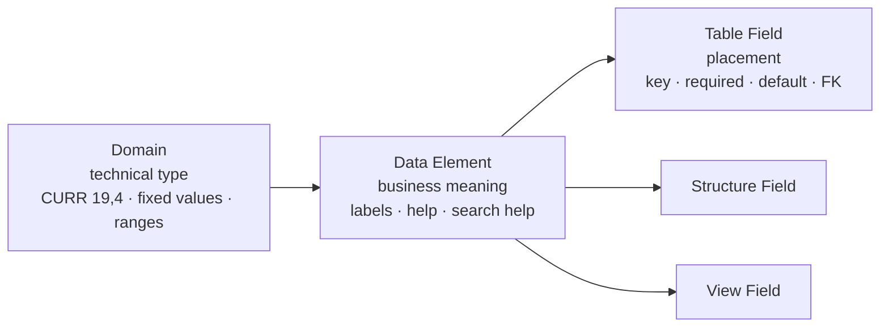
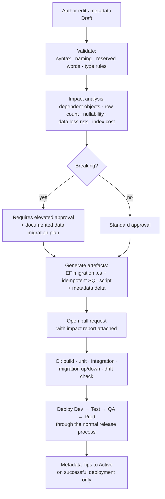

# 07 — Data Dictionary (SE11-like)

An original web data dictionary: a metadata layer describing every table, field,
domain and data element in the system, used by the table browser, the custom
object designer, reporting, and the UI for labels, help and value helps.

## 7.1 Layered type model

The value of the SAP dictionary concept is that a business type is defined once
and reused everywhere. Three layers:

| Layer | Answers | Example |
| --- | --- | --- |
| **Domain** | What is it technically? | `DOM_AMOUNT` = `decimal(19,4)`, signed, thousands-separated |
| **Data element** | What does it mean to the business? | `DE_LOCAL_AMOUNT` = "Amount in local currency", short/medium/long labels, F1 help, search help |
| **Field** | Where does it sit and how does it behave here? | `fin.JournalEntryLine.LocalAmount` — not key, required, no default |

Changing a domain's length changes it everywhere it is used, which is the point,
and also why activation needs impact analysis (§7.4).

## 7.2 Metadata tables

The sixteen tables from §10, with what each holds:

| Table | Holds |
| --- | --- |
| `cfg.DictionaryObject` | Registry of every dictionary object: type, name, status, package, owner, versions |
| `cfg.DictionaryDomain` | Data type, length, decimals, sign, case, conversion routine, value range |
| `cfg.DictionaryDomainValue` | Fixed values with descriptions — the source of dropdowns |
| `cfg.DictionaryDataElement` | Domain reference, short/medium/long/heading labels, documentation, search help, parameter id |
| `cfg.DictionaryTable` | Schema, name, description, delivery class, category, maintenance flag, technical settings |
| `cfg.DictionaryTableField` | Position, name, data element, key flag, not-null, default, FK, check table, search help |
| `cfg.DictionaryStructure` / `…StructureField` | Reusable field groups included into tables — how `TenantId, CreatedAt, CreatedBy, …` is defined once |
| `cfg.DictionaryView` / `…ViewField` | Join definitions, projections, selection conditions |
| `cfg.DictionaryForeignKey` | Source and target fields, cardinality, check-table semantics |
| `cfg.DictionaryIndex` | Index name, uniqueness, column list and order, included columns |
| `cfg.DictionarySearchHelp` / `…Parameter` | Value help: source table or view, export/import parameters, display fields |
| `cfg.DictionaryLockObject` | Logical lock definitions for coarse-grained business locking |
| `cfg.DictionaryChangeLog` | Every change to every object, with before and after |

Labels and documentation are **translatable**: label text lives in a translation
table keyed by (object, field, language), so Khmer and English come from the
dictionary rather than from UI5 resource bundles for data-driven screens.

## 7.3 Lifecycle

`Draft → Checked → Active → Inactive → Deprecated`

| Status | Meaning | Runtime effect |
| --- | --- | --- |
| Draft | Being edited | Invisible to runtime |
| Checked | Passed syntax and consistency validation | Invisible to runtime |
| Active | Matches the deployed physical schema | Used by browser, reporting, UI |
| Inactive | Was active, temporarily withdrawn | Hidden; physical object untouched |
| Deprecated | Superseded, retained for history | Read-only, flagged in the browser |

Actions: create, copy, change, display, validate, compare (metadata vs physical
schema), activate, deactivate, show dependencies, show generated SQL, history.

## ADR-13 — Activation never executes DDL from the browser

**Decision.** Activating a dictionary object generates a reviewed EF Core
migration, which reaches production through the normal CI/CD pipeline. The
application's runtime SQL principal has no DDL rights at all.

**Why.** §10 requires it, and the requirement is right. Browser-issued DDL means
a schema change with no code review, no diff, no test run, no rollback artefact,
and no way to reproduce an environment. It also means an application account
that holds `ALTER` on production — which turns any SQL injection or session
hijack from a data problem into a schema problem.

### Activation pipeline

The status flips to `Active` **after** deployment confirms the physical object
exists, never before. That ordering is what keeps the dictionary honest: an
`Active` object is a promise that the column is really there, and the table
browser and reporting rely on that promise.

### Breaking versus non-breaking

| Change | Class | Handling |
| --- | --- | --- |
| Add nullable column | Non-breaking | Standard approval |
| Add table, add index, add search help | Non-breaking | Standard approval |
| Widen a column | Non-breaking | Standard approval |
| Add required column to a populated table | **Breaking** | Needs a default or a backfill plan |
| Narrow a column, change type, change decimals | **Breaking** | Needs data migration and a truncation report |
| Drop column or table | **Breaking** | Elevated approval; blocked outright for `fin.*` posted-document tables |
| Change a domain used by *n* fields | **Breaking if n > 0** | Impact report lists every affected field |

## 7.4 Drift control

Two representations of the schema exist — the metadata and the physical
database — so they can disagree. The `Compare` action, and a CI job that runs it
on every build, reports:

- Metadata objects marked `Active` with no physical counterpart.
- Physical objects with no metadata (permitted for `sec.*` and `audit.*`
  internals, which are deliberately outside the dictionary; flagged everywhere
  else).
- Type, length, nullability, key and index mismatches.

Drift fails the build. Allowing it to accumulate is how a dictionary becomes
documentation that nobody trusts, and once nobody trusts it the table browser
and the custom-field designer built on top of it become unusable.

## 7.5 Search helps

A search help is a reusable value help: a source table or view, the field
returned, the fields displayed, optional filter parameters bound to other
screen fields, and an optional restriction by authorisation.

Search helps are attached at the data element level so every field using
`DE_COST_CENTER` gets the cost centre value help automatically — including
custom fields and table browser filters. Company-code-dependent helps receive
the current context as an import parameter, so the cost centre help on a
company code 1000 screen offers only cost centres valid for 1000 on the posting
date.

## 7.6 Coverage

Every table in `org`, `cfg`, `mdm`, `fin`, `co`, `wf`, `rpt`, `intg` is
registered in the dictionary and generated into it during Phase 2 from the EF
model, so the dictionary starts complete rather than being backfilled by hand.

`sec.*` and `audit.*` are registered as objects but marked
**not browsable** — they appear in dependency analysis and documentation, and
the table browser will refuse them regardless of authorisation
([08](08-table-browser-se16n.md)).
