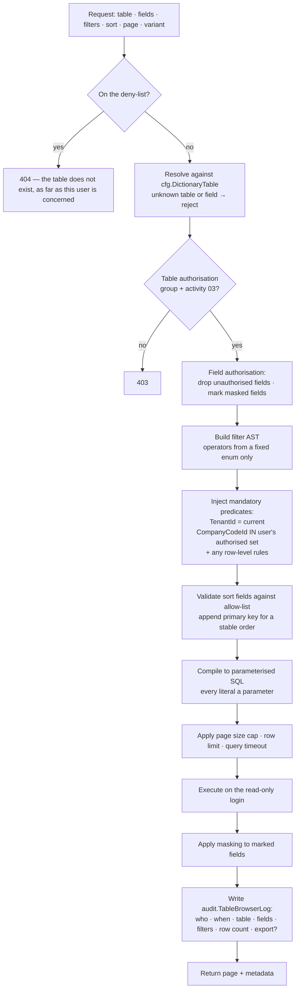

# 08 — General Table Browser (SE16N-like)

A generic, metadata-driven, **read-only** query tool over authorised tables and
views. It is the single most security-sensitive feature in the specification: a
tool whose entire purpose is reading arbitrary business tables, offered to
end users. The design below is built around that.

## 8.1 Threat model

Stating what the design must prevent, before describing what it does:

| Threat | Control |
| --- | --- |
| Reading another tenant's data | Tenant predicate injected server-side and unremovable; SQL Server Row-Level Security as a second, independent layer |
| Reading a company code the user is not authorised for | Org-value predicate injected from the user's authorisations |
| Reading `sec.*`, credentials, tokens, audit tamper records | Deny-list checked before authorisation; these tables are never browsable by anyone |
| Reading sensitive columns (bank account, salary, tax ID) | Field-level authorisation and masking |
| SQL injection through filter values or field names | No user-supplied SQL. A validated AST compiled to a parameterised query |
| Writing anything | ADR-14: a SQL login that physically lacks write permission |
| Exfiltrating the database via export | Separate export authorisation, row caps, and every export audited |
| Denial of service through an unbounded scan | Mandatory pagination, row limits, query timeout, cost estimate |
| Using the browser to discover schema for a later attack | Table list filtered to authorised tables; unauthorised tables are not merely disabled, they are absent |

## ADR-14 — SE16N runs on a physically read-only SQL login

**Decision.** Table browser and reporting queries execute on a dedicated SQL
Server login granted `SELECT` on `org`, `cfg`, `mdm`, `fin`, `co`, `wf`, `rpt`,
`intg` and explicitly **denied** everything on `sec` and `audit`, with no
`INSERT`, `UPDATE`, `DELETE`, `EXECUTE` or DDL anywhere.

**Why.** Every other control in this document is application logic, and
application logic has bugs. This one is enforced by the database engine. If a
defect in the query builder ever allowed a crafted statement through, the worst
outcome is an error, not a modification. §11's "never allow hidden edits to
posted records" deserves a control that does not depend on the correctness of
the code that might violate it.

It also gives the read replica story for free: the read-only login is the
natural principal to point at a replica when one exists.

## 8.2 Query pipeline

Two details in that flow carry most of the weight.

**An unauthorised table returns 404, not 403.** A 403 confirms the table exists,
which is information. The table list the UI offers is already filtered to what
the user may see, so a 404 is also the honest answer from that user's view of
the system.

**Predicates are injected, not merged.** The tenant and company-code predicates
are `AND`-ed onto the compiled statement after user filters are compiled, at a
layer the user's input cannot reach. There is no code path where a user filter
can replace, disable or short-circuit them — not a filter named `TenantId`, not
an `OR`, not an empty filter set.

## 8.3 Operators

The fixed set from §11. Each maps to one parameterised SQL form; nothing else is
accepted.

| Operator | SQL | Notes |
| --- | --- | --- |
| `eq` / `ne` | `= @p` / `<> @p` | |
| `gt` / `ge` / `lt` / `le` | `> @p` etc. | Type-checked against the field's domain |
| `between` | `BETWEEN @p1 AND @p2` | |
| `contains` | `LIKE '%' + @p + '%'` | Wildcards in the value are **escaped** |
| `startsWith` / `endsWith` | `LIKE @p + '%'` / `LIKE '%' + @p` | `startsWith` is index-friendly; the other two are not, and the UI says so |
| `empty` / `notEmpty` | `IS NULL OR = ''` / negation | |
| `in` / `notIn` | `IN (@p1…@pn)` | List length capped |

Include and exclude ranges (SAP select-option semantics) compose these into an
`(include1 OR include2 …) AND NOT (exclude1 OR exclude2 …)` structure, which is
built structurally in the AST rather than by string assembly.

`contains` on a large table is the classic way to melt a database. The cost
estimator (§8.5) flags it, and a leading-wildcard search on a table above a
configured row count requires an additional authorisation.

## 8.4 Authorisation levels

Four levels, all enforced server-side, matching §11:

1. **Table level** — every table belongs to an authorisation group
   (`FI_DOCUMENT`, `BP_MASTER`, `CONFIG`, `PAYROLL`…). The user needs activity
   `03` (display) on that group. Groups, not individual tables, so authorisation
   stays maintainable as tables are added.
2. **Field level** — sensitive fields carry a field authorisation. Without it
   the field is either dropped from the result or returned masked, per its
   configuration. Dropped is safer; masked is friendlier for fields like a bank
   account where the last four digits are useful and legitimate.
3. **Row level** — the tenant predicate always; the company-code predicate
   whenever the table has one; plus optional rules by cost centre, profit centre
   or branch for tables that carry them.
4. **Action level** — displaying, exporting, and saving a public variant are
   separately authorised. Export in particular is its own permission with its own
   row cap, because export is the difference between reading data and taking it.

### Never browsable

`sec.User`, `sec.PasswordHistory`, `sec.UserSession`, anything holding tokens or
secrets, `audit.*` tamper-evidence structures, and the outbox payload table
(which can contain personal data in transit). Deny-listed at the metadata level,
checked before authorisation, and additionally unreachable because the read-only
login is `DENY`-ed on those schemas. Three independent layers, because this is
the case where a single mistake is unrecoverable.

## 8.5 Resource protection

| Control | Default | Configurable per |
| --- | --- | --- |
| Page size | 100, maximum 1,000 | Role |
| Total rows returned | 10,000 | Role |
| Export rows | 100,000 | Role, separately from display |
| Query timeout | 30 s | Role |
| Total count | Only on request | — |
| Cost estimate | Warn above a threshold | Table |

Total count is not returned by default. `COUNT(*)` over a filtered journal table
of hundreds of millions of rows can cost more than the page itself; §22.1 says
return it only when requested or when it is cheap, and the pagination contract
makes it an explicit opt-in.

Sorting always appends the primary key to whatever the user chose. Without it,
two pages of a non-unique sort can repeat or skip rows — the deterministic
ordering requirement in §22.1.

## 8.6 Usability features

Because a security tool nobody can use gets replaced by direct database access,
which is worse:

- Field selection with a picker showing description, data element and type.
- Saved **variants** (selection criteria) and **layouts** (columns, order,
  widths, sort, grouping), private or shared; sharing a variant is authorised.
- Foreign key navigation — click a business partner ID in a journal line and
  open that partner, provided the target table is also authorised.
- Inline documentation from the data element's F1 help.
- Export to Excel and CSV, subject to export authorisation and caps.
- Result count on demand.
- The generated SQL, shown to users with a diagnostic authorisation. Useful for
  support, and it makes the tool's behaviour inspectable rather than magic.

## 8.7 Audit

Every query writes `audit.TableBrowserLog`: user, timestamp, tenant, table,
selected fields, filter values, sort, row count returned, whether exported,
duration, correlation ID and source IP. Filter values are recorded because
"who looked up this partner's bank details, and when" is exactly the question an
investigation asks.

The log is retained under the audit retention policy and is itself not
browsable through the tool.
