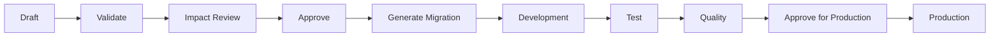

# 09 — Custom Objects: Z/Y Tables and ZZ Fields

Every ERP is extended by its customers, and how that extension works determines
whether the system stays upgradeable or fossilises. Two mechanisms: **custom
tables** (new objects) and **custom fields** (extensions to standard objects).

## 9.1 Namespaces

| Prefix | Owner | Example |
| --- | --- | --- |
| `Z*` | Customer objects | `ZSUPPLIER_RATING`, `ZLAND_MASTER`, `ZCANE_CONTRACT` |
| `Y*` | Partner / implementer objects | `YIMPL_MIGRATION_MAP` |
| `ZZ*` | Custom fields on standard objects | `ZZOldAssetNumber`, `ZZLandArea`, `ZZContractReference` |

Reserved: everything else. The designer rejects a name that does not match its
namespace, collides with an existing object, or uses a SQL Server reserved word
or a name reserved by the product for future standard objects. §23 makes
"custom tables cannot use reserved names" a mandatory test.

Custom objects live in their own schema per type — `zmdm`, `zfin`, `zco` and so
on — mirroring the standard schema they extend. That keeps a `SELECT` against
`fin` unambiguous about what is standard, and makes upgrade impact analysis a
schema-level question.

<a id="adr-12"></a>
## ADR-12 — Custom fields are real typed columns

**Decision.** A `ZZ` field on a standard object becomes a real, typed,
constrained, indexable column, created by the same generated-migration pipeline
as any other schema change. A JSON extension column exists **only** for fields
explicitly classified as non-reportable annotations.

**Why.** The tempting alternative is a JSON column or an entity-attribute-value
table: no migration, instant field creation, no deployment. It fails on
everything the specification asks for downstream. §12 says so directly — "do not
keep important reportable/accounting fields only in unvalidated JSON" — and the
reasons compound:

| Requirement | Real column | JSON / EAV |
| --- | --- | --- |
| Filter and sort in SE16N | Native | Expression-based, unindexed |
| Report grouping and totals | Native | Cast per row, no statistics |
| Referential integrity to a check table | FK | None |
| Type and length validation | Database-enforced | Application-only, bypassable |
| Data dictionary registration | Automatic | Synthetic and drift-prone |
| Query plan quality on a large table | Indexable | Scans |

The cost of the real-column approach is that adding a field requires a
deployment. That is the correct cost. A field that is going to appear on a
statutory report deserves a review and a release; a field that does not can go
in the JSON annotation column and skip both.

**Classification is made by the requester and confirmed at approval:**

| Class | Storage | Examples |
| --- | --- | --- |
| Reportable / accounting | Real column | `ZZLandArea` on a contract, `ZZOldAssetNumber` on an asset |
| Non-reportable annotation | `Extensions` JSON column | UI preferences, free-text internal notes, integration scratch values |

## 9.2 Custom tables

Supported categories, each with a mandated key shape so custom tables behave
like standard ones:

| Category | Purpose | Key shape |
| --- | --- | --- |
| Master | Independent master data | Tenant + code |
| Transaction header | Document header | Tenant + company code + fiscal year + document number |
| Transaction item | Document line | Header key + line number |
| Configuration | Settings | Tenant + code |
| Translation | Language-dependent text | Object key + language |
| History | Change history | Object key + valid-from |
| Relationship | Link between two objects | Source + target + type + validity |

### Mandatory fields

Every custom table receives these, generated rather than typed by the designer:

```
TenantId, Id, CreatedAt, CreatedBy, ModifiedAt, ModifiedBy, RowVersion, IsActive
```

Transaction categories additionally receive:

```
CompanyCodeId, FiscalYear, DocumentNumber, Status, ValidFrom, ValidTo
```

These come from a dictionary **structure** ([07](07-data-dictionary-se11.md)),
so a change to the standard audit field set propagates to every custom table
through the normal activation pipeline rather than by hand-editing dozens of
objects.

### What the designer configures

Name, description, category, delivery class, authorisation group, key fields,
data fields with domains and data elements, defaults, required flags, unique
constraints, foreign keys and check tables, search helps, indexes, audit
enablement, effective dating, company-code and tenant dependency, translation
support, and API/reporting exposure.

Everything is expressed as dictionary metadata. There is no separate custom
object model — a `Z` table is a dictionary table whose name starts with `Z`, so
it gets SE16N, search helps, labels, translation and documentation with no extra
work.

## 9.3 Custom fields on standard objects

Permitted extension points, per §12:

| Object | Table | Notes |
| --- | --- | --- |
| Business Partner | `mdm.BusinessPartner` | Also the company-code, customer and vendor facets |
| Asset | asset master | Common for legacy asset numbers |
| Journal header | `fin.JournalEntryHeader` | Additive only, never affects balancing |
| Journal line | `fin.JournalEntryLine` | **Highest scrutiny** — see below |
| Cost centre / Profit centre / Internal order | `co.*` | |

For each field: label and description (translatable), type via domain, length,
decimals, required flag, default, search help, fixed values, validation rule,
display order, screen section, field-level authorisation, whether it is exposed
to reporting, and whether it is exposed on the API.

### Journal line extensions need extra care

A `ZZ` column on `fin.JournalEntryLine` is added to the largest and hottest
table in the system, one that is partitioned and insert-only. The rules:

- **Nullable, always.** A required custom field is enforced by the posting
  engine's field-status check, not by a `NOT NULL` constraint that would break
  the backfill of existing partitions.
- **No default expression** evaluated per row at creation time on a populated
  table.
- **Indexed only on demand,** with the impact report showing insert-cost effect.
- **Never participates in balancing.** Custom dimensions can be reported on;
  they cannot change what "balanced" means.
- Impact analysis reports current row count and estimated added storage before
  approval, because the answer is frequently "hundreds of millions of rows".

## 9.4 Lifecycle

The §12 lifecycle, with the gate at each step:



| Step | Gate |
| --- | --- |
| Validate | Naming, namespace, reserved words, type rules, key completeness, FK targets exist |
| Impact Review | Dependent objects, affected rows, storage estimate, index cost, data-loss risk, API and report surface changes |
| Approve | Role-based; breaking changes and `fin.*` extensions need elevated approval |
| Generate Migration | EF migration plus idempotent SQL, committed to a pull request with the impact report attached |
| Development → Test → Quality | The normal CI/CD path; migration up **and down** are both executed in CI |
| Approve for Production | Separate approval; maker ≠ approver |
| Production | Metadata flips to `Active` only after deployment succeeds |

Tracked throughout: version, transport/change request id, developer, approver,
environment, timestamps, dependencies, and the rollback artefact.

**Rollback.** Every generated migration ships with a tested `Down`. For a
non-breaking additive change, `Down` drops the column. For anything that
destroys data, `Down` cannot restore it, so those changes require a pre-change
backup reference recorded on the request — an honest rollback plan rather than a
theoretical one.

## 9.5 Runtime behaviour

Custom fields are not special cases at runtime. They appear:

- On UI5 screens, rendered into the configured section from dictionary metadata
  by a generic extension fragment, in the configured order, with the configured
  label and search help.
- In SE16N, as ordinary fields of the table, subject to their field-level
  authorisation.
- In reporting, when flagged reportable.
- On the API, when flagged API-exposed, inside an `extensions` object on the DTO
  rather than flattened into the standard contract — so a custom field never
  collides with a future standard field name.
- In validation, through the rule attached to the field, executed server-side
  with the same field-level error contract as standard fields.

The last point is the one that makes the framework worth building: a custom
field that cannot be validated, authorised and reported on is just a note.
