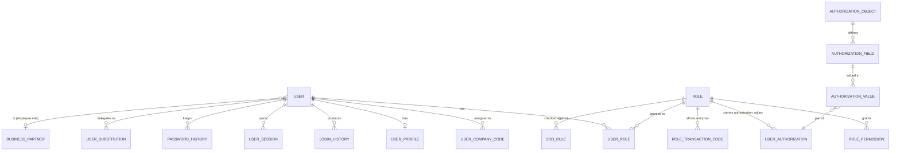

# 10 — Users, Authorisation and Security

## 10.1 Model



The tables are those listed in §18. Two relationships are worth calling out:

**A user may be linked to a Business Partner** holding the `EMPL` role. That is
what lets workflow route "the cost centre manager" to a person, and what lets
an employee expense claim identify its claimant without a second identity store.

**Substitution is a first-class object**, not a workaround. An approver going on
leave delegates to a substitute for a date range, optionally scoped to a subset
of their authorisations. Without it, the real-world behaviour is password
sharing, and the audit trail becomes fiction.

## 10.2 Authorisation objects

Roles alone cannot express "may post journals in company code 1000, up to
50,000 USD, document types SA and KR". That needs a value-carrying model, so the
SAP authorisation object concept is used: an object with named fields, and a
role granting specific values for those fields.

| Object | Fields | Guards |
| --- | --- | --- |
| `F_BKPF_BUK` | `BUKRS` (company code), `ACTVT` | Journal posting per company code |
| `F_BKPF_BLA` | `BLART` (document type), `ACTVT` | Which document types may be posted |
| `F_BKPF_AMT` | `BUKRS`, `CURR`, `AMOUNT_TO` | Posting value limit |
| `F_BP_GEN` | `BP_ROLE`, `ACTVT` | BP maintenance per role |
| `F_BP_BANK` | `ACTVT` | Bank detail maintenance — separately held |
| `K_CSKS` | `KOSTL` range, `ACTVT` | Cost centre |
| `K_PCA` | `PRCTR` range, `ACTVT` | Profit centre |
| `A_ANLA` | `BUKRS`, `ANLKL` (asset class), `ACTVT` | Asset master and transactions |
| `S_TABU_DIS` | `DICBERCLS` (table auth. group), `ACTVT` | Table browser table access |
| `S_TABU_FLD` | `FIELDGRP`, `ACTVT` | Table browser field access |
| `S_TCODE` | `TCD` | Transaction code entry |
| `S_EXPORT` | `SCOPE`, `MAXROWS` | Data export |
| `W_APPROVE` | `WFTYPE`, `AMOUNT_TO` | Workflow approval authority |

`ACTVT` follows the familiar convention: `01` create, `02` change, `03` display,
`06` delete, `43` release/approve.

### Enforcement

Two complementary mechanisms:

```
[Authorize(Policy = "F_BKPF_BUK:01")]     // coarse: does the user hold the object at all?

_authz.Require("F_BKPF_BUK",              // fine: with these specific values?
    ("BUKRS", request.CompanyCode),
    ("ACTVT", "01"));
```

The attribute is a cheap pre-filter at the endpoint. The explicit check inside
the handler is the one that matters, because only the handler knows the actual
company code, amount and document type being posted. Both are server-side; §22.1
is explicit that hiding a button is not authorisation.

**Deny by default.** No object held means no access. There is no implicit grant,
no "authenticated users may display", and no wildcard role except a
break-glass administrator whose every use is logged and alerted.

## 10.3 Organisational restriction

Every query and command is scoped by the user's organisational authorisations:

| Level | Applied to |
| --- | --- |
| Tenant | Everything, always, non-negotiable |
| Company code | Every financial object |
| Cost centre / profit centre | CO objects and journal lines carrying them |
| Branch / plant | Operational objects |
| Document type | Posting and display of documents |
| Amount | Posting and approval |

The company-code filter is applied as a query predicate, not as a post-filter on
results. Post-filtering leaks through pagination — a user sees "page 3 of 40"
computed over rows they cannot read — and leaks timing information.

## 10.4 Maker-checker and segregation of duties

**Maker-checker.** When enabled for a document type or a master data object, the
user who created or changed a record cannot approve it. Enforced at two points:
the workflow service excludes the maker from the eligible approver set, and the
posting engine re-checks the maker/approver identity before writing. Two checks
because the first is a routing decision and the second is a control — routing
can be reconfigured, the control should not be bypassable by reconfiguration.

Substitution does not defeat it: a substitute acting for the maker is still the
maker for this purpose.

**Segregation of duties.** `sec.SegregationOfDutiesRule` holds conflicting pairs
of authorisation objects or transaction codes with a severity and a rationale.
Typical rules:

| Conflict | Risk |
| --- | --- |
| Maintain vendor bank details **and** run payments | Redirect payments to an attacker-controlled account |
| Create vendor **and** post vendor invoice | Fictitious vendor fraud |
| Post journal **and** approve journal | Unreviewed postings |
| Maintain user roles **and** post financial documents | Self-granting authority |
| Maintain customer credit limit **and** release blocked orders | Concealed credit risk |

Rules are evaluated when a role is assigned to a user and when a role's contents
change, producing either a block or a documented, time-boxed, approved
exception. They are also reported periodically, because SoD conflicts arrive
through role drift far more often than through a single obviously bad
assignment.

## 10.5 User types and authentication

| Type | Interactive | MFA | Credential |
| --- | --- | --- | --- |
| Dialog | Yes | Required (configurable per role) | Password / OIDC |
| Service | No | n/a | Client credential, rotated |
| Integration | No | n/a | API key or client credential, IP-restricted |
| API | No | n/a | Token, scoped |
| Background | No | n/a | Internal principal, no external login |
| Auditor | Yes | Required | Password / OIDC, display-only by construction |

The **Auditor** type is display-only at the type level, not merely by role
assignment — no combination of roles grants an auditor a change authority. This
makes "give the auditor access" a safe action rather than a careful one.

Session and password policy: configurable length, complexity, history depth,
expiry, lockout threshold and window, idle timeout, absolute session lifetime,
and concurrent session limits. Failed logins, lockouts, password changes and
role changes all raise audit events.

## 10.6 Data protection

| Concern | Treatment |
| --- | --- |
| Passwords | ASP.NET Core Identity hashing; never logged, never exported, never browsable |
| Bank details | Field-level authorisation, masked by default, changes go through workflow, full value in audit but access-controlled |
| Tax and national identifiers | Field-level authorisation, masked in list views |
| Tokens and API keys | Stored hashed; shown once at creation |
| Personal data | Retention policy per object; deletion honoured for master data where no posted document references it, otherwise the record is restricted rather than deleted — a posted invoice cannot lose its counterparty |
| Logs | §22.1 prohibits passwords, tokens and full bank secrets in logs; a Serilog destructuring policy enforces it rather than relying on developers remembering |

## 10.7 OWASP alignment

| Risk | Control in this design |
| --- | --- |
| Broken access control | Deny by default; server-side checks in handlers; org predicates in queries; RLS as backstop; 404 for unauthorised objects |
| Cryptographic failures | TLS everywhere; Identity password hashing; secrets from a secret store, never `.env` in production |
| Injection | No dynamic SQL anywhere except the browser's AST compiler, which parameterises everything; EF parameterises by default |
| Insecure design | Maker-checker, SoD, immutable ledger, read-only browser login |
| Security misconfiguration | Configuration is code and reviewed; the container runs non-root; DDL rights withheld from the runtime principal |
| Vulnerable components | Dependency scanning in CI; the `Microsoft.OpenApi` advisory already found and pinned in this repository |
| Authentication failures | Lockout, MFA, session limits, password history |
| Software and data integrity | Signed artefacts, migrations only through CI/CD, no browser DDL |
| Logging and monitoring failures | Business audit separate from technical logs, tamper detection, retention, alerting on security events |
| SSRF | Outbound integration targets are allow-listed configuration, not user input |
