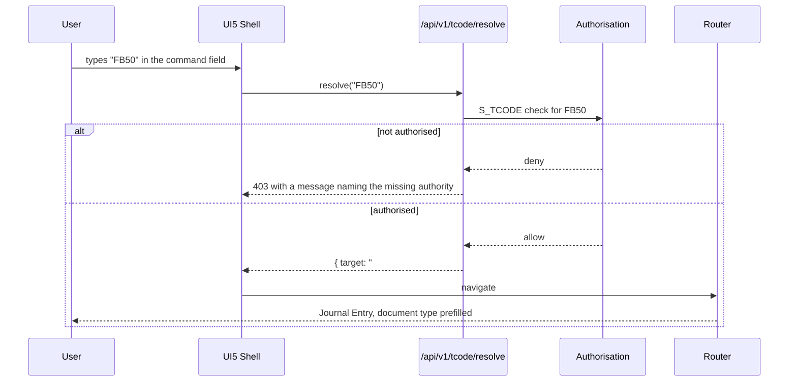

# 11 — Transaction Code Framework

## 11.1 Purpose

A transaction code is a short alias that takes an experienced user straight to a
function. For anyone who has worked in SAP, typing `FB50` is faster than
navigating a menu, and preserving that muscle memory is a real adoption
advantage. Underneath, a T-code here is just a configurable mapping from an
alias to a route plus an authorisation requirement.

Two design points make it more than a bookmark list:

- **T-codes are configuration, not code.** New ones are added by configuration,
  including for custom applications, without a deployment.
- **`S_TCODE` is a genuine authorisation check**, not a menu filter. Entering a
  T-code the user does not hold fails, whether they typed it, bookmarked the
  resulting URL, or called the API directly.

## 11.2 Registry

`cfg.TransactionCode`:

| Field | Purpose |
| --- | --- |
| `Code` | `FB50`, `BP`, `SE16N` — unique per tenant |
| `Description` | Translatable |
| `Category` | Configuration, Master Data, Transaction, Reporting, Tools |
| `Module` | Owning module |
| `TargetType` | `UI5Route`, `Report`, `Job`, `ExternalUrl` |
| `Target` | Route pattern, e.g. `#/journal/create` |
| `DefaultParameters` | Preset values, e.g. document type `SA` for `FB50` |
| `AuthorizationObject` + values | What `S_TCODE` and the object check require |
| `IsActive`, `ValidFrom`, `ValidTo` | Lifecycle |
| `Icon`, `Keywords` | Launchpad tile and search |

`sec.RoleTransactionCode` grants codes to roles, which is what populates a
user's launchpad and their permitted search results.

## 11.3 Initial catalogue

The §9 list, with the module that owns each:

| Code | Function | Module |
| --- | --- | --- |
| `SPRO` | Configuration workbench | Organization |
| `OBY6` | Company code | Organization |
| `OB13` | Chart of accounts | Finance |
| `OB52` | Posting periods | Organization |
| `FS00` | G/L account master | Finance |
| `BP` | Business partner | BusinessPartner |
| `BUP1` / `BUP2` / `BUP3` | BP create / change / display | BusinessPartner |
| `BP_ROLE` / `BP_SYNC` / `BP_CHECK` | BP role config / sync status / consistency | BusinessPartner |
| `FB50` | Journal entry (enjoy screen) | Finance |
| `FB01` | Journal entry (classic, posting keys) | Finance |
| `FB02` / `FB03` / `FB08` | Change permitted fields / display / reverse | Finance |
| `FBL1N` / `FBL3N` / `FBL5N` | Vendor / G/L / customer line items | Finance |
| `F-28` / `F-53` / `F110` | Incoming / outgoing / automatic payments | Finance |
| `AS01` / `AS02` / `AS03` / `AFAB` | Asset create / change / display / depreciation run | Assets |
| `KS01` / `KS02` / `KS03` | Cost centre create / change / display | Controlling |
| `KE51` | Profit centre | Controlling |
| `KO01` / `KO88` | Internal order / settlement | Controlling |
| `SE11` | Data dictionary | DataDictionary |
| `SE16N` | Table browser | TableBrowser |

`FB02` deserves its qualifier. It changes only fields that are *permitted to
change* on a posted document — assignment, reference, line text, payment terms
in some configurations. It never touches an account, an amount, a date or a
posting key, and every change it makes writes a change document. It is not an
exception to the immutability rule ([ADR-07](05-universal-journal-and-posting.md#adr-07));
the changeable fields are a configured, audited allow-list, and they are stored
in a side table rather than by updating the posted line.

## 11.4 Resolution

Resolution happens **server-side**. A client-side map would ship the full T-code
catalogue to every browser, disclosing which functions exist, and would make the
authorisation check advisory. The response also carries the human-readable
denial reason, which turns "nothing happens when I type FB50" into "you do not
hold S_TCODE for FB50; request role FI_ACCOUNTANT".

## 11.5 Global search

One search field in the shell, searching across types, each result scoped by the
user's authorisations:

| Type | Matches on | Goes to |
| --- | --- | --- |
| T-code | Code, description, keywords | The mapped route |
| Application | Title, keywords | The app |
| Business partner | Number, name, search terms, tax number | BP display |
| Customer / vendor | The BP with the role tab preselected | BP display |
| G/L account | Number, short and long text | `FS00` |
| Asset | Number, description, old asset number | `AS03` |
| Accounting document | Company code + year + number, reference, amount | `FB03` |
| Report | Title, keywords | The report |
| Dictionary object | Table, field, data element, domain | `SE11` |

Behaviour details that decide whether the feature gets used:

- An **exact T-code match wins** and offers direct navigation on Enter. A user
  typing `BP` wants the BP transaction, not a list of partners whose name
  contains "bp".
- Everything else is grouped by type with a count, showing the top few per
  group.
- Results are authorisation-filtered **before** paging, so a user never sees
  "24 results" and then five rows.
- Searches are audited at the same level as the browser, because global search
  over business partners and documents is an information-disclosure surface in
  the same way SE16N is.

## 11.6 Launchpad

The shell home page composes from the same registry:

- **Tiles** for the T-codes and applications granted to the user's roles,
  grouped by category, with dynamic counters where useful (open approvals,
  parked documents, overdue items).
- **Favourites**, user-maintained.
- **Recents**, from the user's navigation history.
- **Approval inbox**, from Workflow, with counts by type.
- **Notifications**, pushed over SignalR.
- **KPI and analytical cards** for the user's role.
- **Context selectors** — company code, fiscal period, language, currency —
  owned by the shell and published to every embedded app.

A user with no roles sees an empty launchpad and a message telling them who to
contact. That is deliberate: deny by default, visibly.
