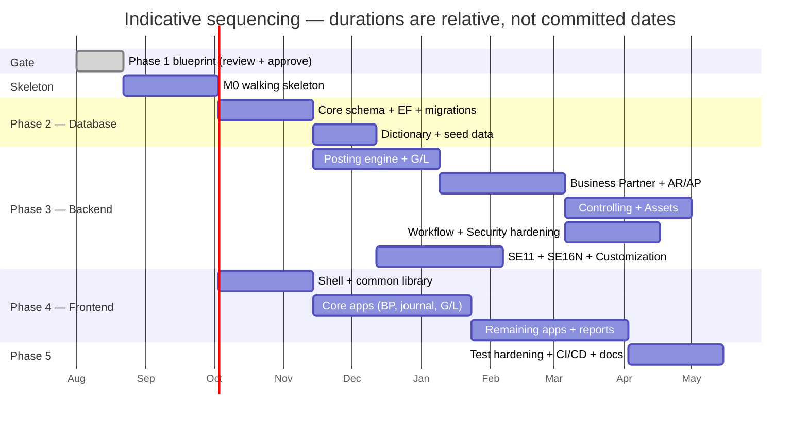

# 14 — Roadmap

## 14.1 A note on sequencing

§25 sets out five phases: blueprint, database, backend, frontend, then testing
and deployment. That is a sound structure for *deliverables*, and this roadmap
keeps it.

It is a poor structure for *execution* if taken literally, and it is worth being
direct about why. Building the entire database, then the entire backend, then
the entire frontend means the first time anyone posts a journal entry through a
real screen is somewhere in month nine — and that is when the design errors
surface, when they are most expensive to fix. Everything built before that point
rests on assumptions nobody has tested.

The recommendation is to keep the five phases as deliverable gates, and add a
**walking skeleton** at the front: one very thin vertical slice through every
layer, delivered before breadth begins. It proves the architecture end to end,
gives every later slice a template to copy, and moves the discovery of design
errors from month nine to month two.

The phase deliverables are unchanged. Only the order in which they are filled in
changes.

## 14.2 Milestones

### M0 — Walking skeleton

The narrowest possible slice that touches everything:

- One tenant, one company code, one chart of accounts, three G/L accounts.
- `fin.JournalEntryHeader` and `fin.JournalEntryLine` with their real key
  structure, partitioning and RLS in place — not a simplified version.
- The posting engine with only the checks the slice needs: period open,
  balanced, authorised. The pipeline shape is complete even though the checks
  are few.
- One REST command endpoint and one OData read feed.
- The UI5 shell with one tile, and a journal entry screen that posts and
  displays.
- A trial balance report reading from the journal.
- One authorisation object, enforced.
- CI running unit, integration and architecture tests against a real SQL Server
  container.

**Exit criterion:** a user logs in, types `FB50`, posts a two-line balanced
document, sees it in a trial balance, and cannot post into a closed period or a
company code they lack. Every subsequent feature is a variation on something
this slice already proved.

### Phase 2 — Database

| Deliverable | Contents |
| --- | --- |
| Table catalogue | Every table, its schema, purpose, key and owning module |
| ERDs | Per schema, plus a cross-schema overview |
| DDL and EF configurations | Generated from the model, reviewed |
| Migrations | With `Down`, both executed in CI |
| RLS and partitioning | Set up now, not retrofitted ([12](12-database-strategy.md)) |
| Dictionary population | Generated from the EF model so SE11 starts complete |
| Seed data | The §24 sample: two companies, three company codes, shared chart, one controlling area, USD/KHR/THB, dual-role BPs, cost and profit centres, internal orders, assets, intercompany and FX documents |

Ordering within the phase: `org` and `cfg` first (everything depends on them),
then `sec`, then `mdm`, then `fin` and `co`, then `wf`, `rpt`, `intg`, `audit`.

### Phase 3 — Backend

Ordered by dependency, not by module number:

1. **Posting engine and G/L** (M3) — the thing everything else calls. Includes
   number ranges, period control, field status, currency translation, tax,
   simulation, reversal.
2. **Business Partner, AR, AP** (M4) — role synchronisation, invoices, payments,
   clearing, dunning, aging, payment runs.
3. **Controlling and Assets** (M5) — derivation, allocations, settlement,
   depreciation areas and runs.
4. **Workflow and security hardening** (M6) — approval routing, maker-checker,
   SoD evaluation, substitution.
5. **SE11, SE16N, Customization** (M7) — can run in parallel with 2–4 once the
   dictionary is populated, since it depends on metadata rather than on finance.

### Phase 4 — Frontend

Starts at M8, in parallel with backend work, once the shell's contract with the
API is settled. Shell and the shared `common` library first — every app depends
on the base controller, error handling, model factory and reusable controls, and
retrofitting those into ten finished apps is a rewrite.

If open question 1 resolves to OpenUI5-only, add a workstream here for the
in-house filter bar, personalisation dialog and variant management, and select a
chart library. That is a material addition to M8, which is why the question is
blocking rather than deferrable.

### Phase 5 — Testing and deployment

Test types from §23 are written continuously alongside their features, not
saved for this phase. What lands here is the hardening: performance testing at
representative volume, security review, the CI/CD pipeline for all four
environments, backup and restore rehearsal, cutover planning, and the
administrator and user guides.

## 14.3 Definition of done

Applies to every milestone, not only the last:

- Unit tests for domain rules; integration tests against a real SQL Server.
- Architecture tests still pass — no new boundary violations.
- Every endpoint authorised, every command validated, every error a
  `ProblemDetails`.
- Every mutable table has `rowversion`; no posted table has an update path.
- Audit records written for every state change.
- Dictionary metadata registered and drift-free.
- Both English and Khmer resource bundles populated; no hard-coded UI strings.
- Migrations run forward and backward in CI.
- Documentation updated in the same pull request as the change.

## 14.4 Risks

| Risk | Impact | Response |
| --- | --- | --- |
| **SAPUI5 licence unresolved** (open question 1) | Phase 4 sizing swings by a full workstream | Answer before M8. Design for OpenUI5 meanwhile |
| **OData package has no stable .NET 10 build** | Read-feed layer may need replacing | Already scoped to read feeds ([ADR-06](01-solution-architecture.md#adr-06)). Re-check at Phase 3 start |
| **Gapless numbering throughput** | Posting serialises per range | Measure at M0 with realistic concurrency; configure non-gapless ranges where legally permitted |
| **Scope** — the specification is roughly a decade of SAP FI/CO functionality | Timeline pressure produces shortcuts in the ledger | Protect the posting engine's correctness above all else. Cut breadth, never integrity |
| **Journal table growth** | Query and maintenance cost | Partitioning from day one; columnstore when measured |
| **Custom-field pipeline latency** | Users expect instant fields, get a release cycle | Set the expectation explicitly; make the non-reportable JSON path genuinely instant so the fast path exists |
| **Khmer rendering and collation** (open question 5) | Late discovery in reports and printed documents | Include Khmer in M0's UI slice so it is exercised from the start |
| **Migration of legacy master data** | Not in the specification, but every ERP has it | Raise as a scoping question now; `BP_SYNC` and `BP_CHECK` exist partly for this |

## 14.5 What happens next

1. Review this blueprint.
2. Answer the six [open questions](README.md#open-questions).
3. On approval, start M0. The first commit of Phase 2 removes the `Products`
   sample and lays down `org` and `cfg`.

Until it is approved, no production code should be written against this
design — per the starting instruction, and because the six open questions can
each change what that code would look like.
