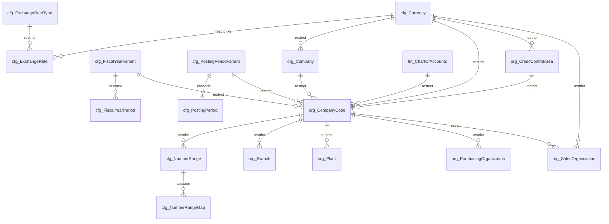
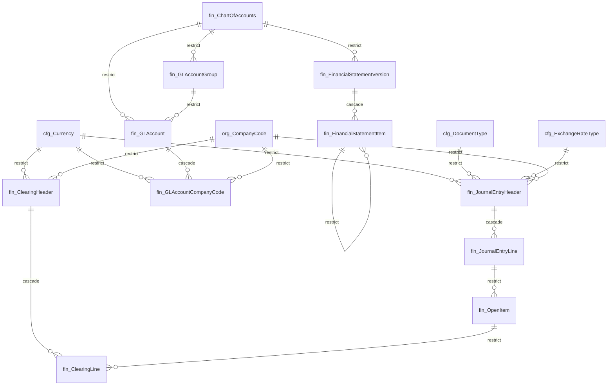
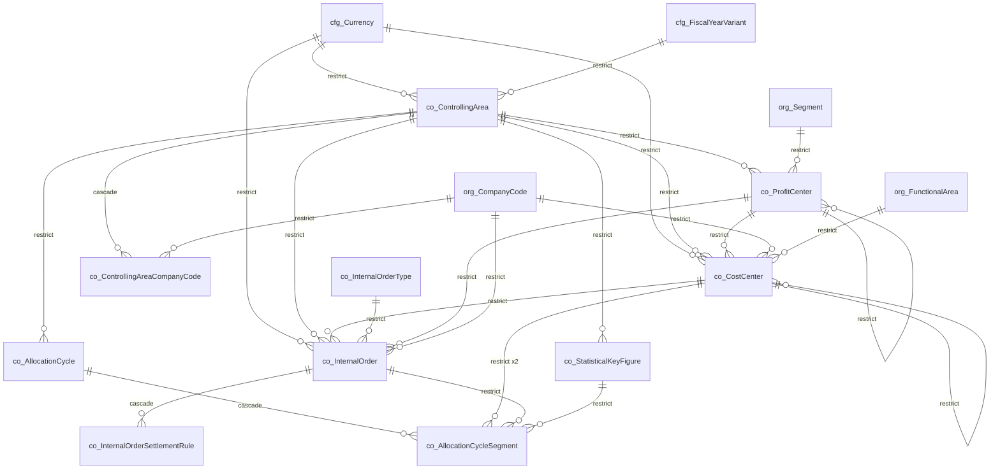
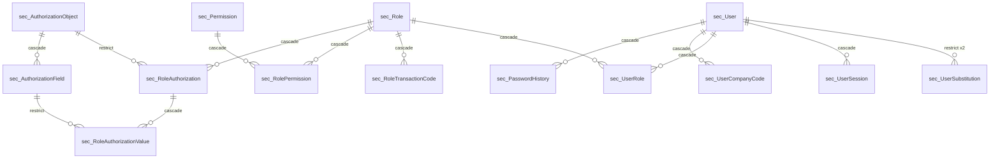
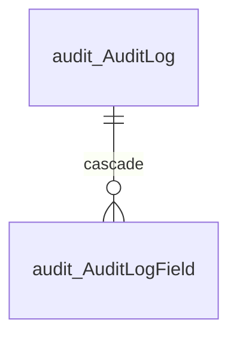

# Phase 2 — Entity Relationship Diagrams

Generated from the foreign keys actually present in the migrated database, so
these show what was built rather than what was intended.

Cross-schema references are drawn in the diagram of the *referencing* schema.
Where two tables are joined by more than one foreign key — a journal header
referencing `Currency` twice, say — the pair is drawn once with the count noted.

## Enterprise structure (org, cfg)

`org.Tenant` is the only table without a `TenantId`: it defines them. Company code freezes its currency, chart of accounts and fiscal year variant once a document is posted — see blueprint 03, §3.4.

## Finance — general ledger and the universal journal (fin)

`JournalEntryLine` shows exactly one foreign key, to its header. The fifteen dimension columns carry none, by ADR-18. `OpenItem` points back at the line so clearing never touches the posted journal (ADR-09).

## Controlling (co)

Cost centres, profit centres and internal orders all key on a controlling area (rule R6), and all carry validity dates (rule R8).

## Business Partner (mdm)

One `BusinessPartner`, many role facets. `BusinessPartnerCustomer` and `BusinessPartnerVendor` both hang off the same `BusinessPartnerCompanyCode` row — that shared row is what makes a dual-role partner one identity (ADR-10).

```mermaid
erDiagram
    mdm_BusinessPartnerGroup ||--o{ mdm_BusinessPartner : "restrict"
    mdm_BusinessPartner ||--o{ mdm_BusinessPartnerAddress : "cascade"
    mdm_BusinessPartner ||--o{ mdm_BusinessPartnerBank : "cascade"
    mdm_BusinessPartnerAddress ||--o{ mdm_BusinessPartnerCommunication : "cascade"
    fin_GLAccount ||--o{ mdm_BusinessPartnerCompanyCode : "restrict"
    mdm_BusinessPartner ||--o{ mdm_BusinessPartnerCompanyCode : "cascade"
    org_CompanyCode ||--o{ mdm_BusinessPartnerCompanyCode : "restrict"
    cfg_Currency ||--o{ mdm_BusinessPartnerCreditProfile : "restrict"
    mdm_BusinessPartner ||--o{ mdm_BusinessPartnerCreditProfile : "cascade"
    org_CreditControlArea ||--o{ mdm_BusinessPartnerCreditProfile : "restrict"
    mdm_BusinessPartnerCompanyCode ||--o{ mdm_BusinessPartnerCustomer : "cascade"
    mdm_BusinessPartner ||--o{ mdm_BusinessPartnerIdentification : "cascade"
    cfg_Currency ||--o{ mdm_BusinessPartnerPurchasingOrganization : "restrict"
    mdm_BusinessPartner ||--o{ mdm_BusinessPartnerPurchasingOrganization : "cascade"
    org_PurchasingOrganization ||--o{ mdm_BusinessPartnerPurchasingOrganization : "restrict"
    mdm_BusinessPartner ||--o{ mdm_BusinessPartnerRelationship : "restrict x2"
    mdm_BusinessPartner ||--o{ mdm_BusinessPartnerRoleAssignment : "cascade"
    mdm_BusinessPartnerRole ||--o{ mdm_BusinessPartnerRoleAssignment : "restrict"
    mdm_BusinessPartnerRole ||--o{ mdm_BusinessPartnerRoleCategory : "cascade"
    cfg_Currency ||--o{ mdm_BusinessPartnerSalesArea : "restrict"
    mdm_BusinessPartner ||--o{ mdm_BusinessPartnerSalesArea : "cascade"
    org_SalesOrganization ||--o{ mdm_BusinessPartnerSalesArea : "restrict"
    mdm_BusinessPartner ||--o{ mdm_BusinessPartnerTaxNumber : "cascade"
    mdm_BusinessPartnerCompanyCode ||--o{ mdm_BusinessPartnerVendor : "cascade"
```

## Security (sec)

`RoleAuthorization` plus `RoleAuthorizationValue` is what lets a role say "post in company code 1000 up to 50,000 USD" rather than merely "may post".

## Audit (audit)

Append-only, enforced by trigger. Not reachable from the table browser at any authorisation level.

