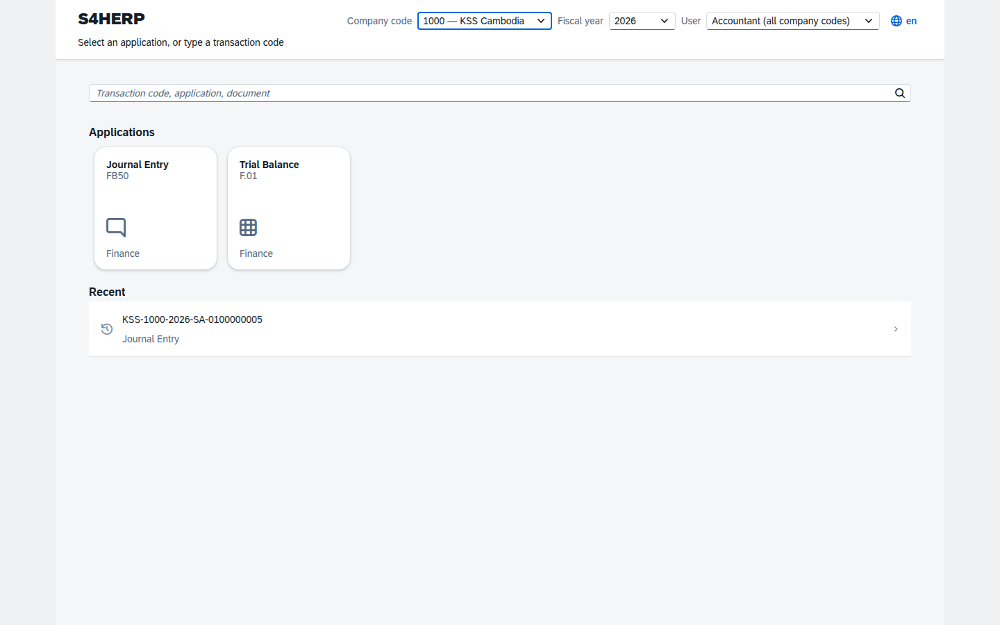

# Phase 4 — SAPUI5 Front End

Status: **delivered and verified in a real browser.** 16/16 browser acceptance
checks passing against the running API — no mocks.

## What was built

An OpenUI5 application: a Launchpad-style shell and three finance applications,
served as static files by the same host that serves the API, so the whole system
is one deployable.

| Application | Route | Transaction |
| --- | --- | --- |
| Launchpad | `#/` | — |
| Journal Entry | `#/journal/create` | FB50 |
| Document display | `#/journal/display/{cc}/{year}/{no}` | FB03 |
| Trial Balance | `#/reports/trial-balance` | F.01 |



### Against §19

| Requirement | State |
| --- | --- |
| SAPUI5 MVC — XML views, controllers, components, models, formatters | Done |
| `Component.js`, `manifest.json`, routing, targets, resource models, device model | Done |
| One-way binding for display, two-way for controlled edit | Done |
| Asynchronous calls, busy indicators, centralised error handling | Done |
| `sap.m.App` / `sap.m.Shell`, `sap.f.DynamicPage`, `sap.m.Table` | Done |
| `MessagePopover` + Messaging for validation messages | Done |
| Launchpad tiles, recents, global T-code search, context selectors | Done |
| SAP Horizon theme, responsive desktop/tablet/phone | Done |
| Resource bundles, English and Khmer, no hard-coded text | Done |
| Frontend authorisation for navigation only; server enforces | Done |
| UI5 Tooling for build and optimised bundles | Done |
| `sap.f.FlexibleColumnLayout`, `sap.m.IconTabBar`, `sap.ui.table.Table` | Not used yet — see limitations |
| `sap.ui.comp` smart controls, `sap.viz` charts | **Not available** — see below |
| QUnit and OPA5 tests | Not built — browser acceptance covers the same ground for now |

<a id="openui5-only"></a>
### OpenUI5 only, and what that costs

Blueprint [ADR-15](../blueprint/01-solution-architecture.md#adr-15) flagged that
`sap.ui.comp` (smart filter bars, smart tables, variant management) and
`sap.viz` charts ship in **SAPUI5 only** and need an SAP licence entitlement.
That question is still unanswered, so this phase was built on OpenUI5 1.120.48
(Apache-2.0), which is the safe direction: gaining smart controls later is a
simplification, the reverse would be a rewrite.

Practical consequences, all visible in the code:

- Filtering and personalisation are hand-built where needed rather than
  declared on a `SmartFilterBar`.
- The trial balance export is a client-side CSV of what is already on screen.
  A server-side export is a separately authorised action (`S_EXPORT`) with its
  own row cap, and belongs with the reporting module.
- Dashboards and analytical cards will need an Apache-2.0-compatible chart
  library.

### OpenUI5 is vendored, not loaded from a CDN

`sdk.openui5.org` is not a runtime dependency. UI5 Tooling resolves the
framework from npm at build time and `ui5 build` emits a self-contained bundle
into `wwwroot`, which the host serves. The system therefore runs with no
outbound network access at all — which an ERP behind a corporate firewall
generally must.

## Verification

`ui5/test/ui-acceptance.mjs` drives Chromium against the real API.

```
== Shell ==
  PASS  Launchpad renders application tiles
  PASS  Journal Entry tile is present
  PASS  Context selectors are in the shell
  PASS  No JavaScript errors during bootstrap
  PASS  No missing resources
== Journal Entry ==
  PASS  Journal entry screen renders the line table
  PASS  Simulation shows the accounting impact
  PASS  Simulation derived the profit centre
  PASS  Posting navigates to the posted document
  PASS  Document shows its lines
== Server refusals reach the user ==
  PASS  An unbalanced document surfaces the server error
  PASS  ...and names the difference
== Authorisation is the server's answer, not the UI's ==
  PASS  An auditor posting is refused by the server
== Trial balance ==
  PASS  Trial balance lists accounts
  PASS  Trial balance foots to zero in the UI
== Internationalisation ==
  PASS  Khmer resource bundle is applied
                                                       16/16 passed
```

The authorisation check is the one worth keeping: it posts as the auditor, whose
UI shows the Post button exactly as it does for anyone else, and asserts that the
**server** refuses. Hiding the button is not authorisation (§22.1), and this test
would fail if the UI ever started pretending otherwise.

## Two bugs found by running it

**`.properties` files were 404ing.** ASP.NET Core's static file middleware serves
only known MIME types, and `.properties` is not one — so every UI5 resource
bundle failed to load, including the application's own i18n. It went unnoticed
at first because the Component preload embeds the app's bundles; only the
framework's message bundles actually 404ed. Left alone it would have broken i18n
the moment a bundle fell outside the preload. Fixed with an explicit content-type
mapping.

**The `DatePicker` bindings declared a `Date` type against string model values,**
which logged "The given date instance isn't valid" on every render and would have
mangled the posting date under a non-ISO locale.

## Limitations

1. **No QUnit or OPA5 tests.** The browser acceptance suite covers the same
   journeys end-to-end, but unit-level control tests are still owed.
2. **The launchpad tile list is hard-coded** in the controller. `cfg.TransactionCode`
   already holds the registry and `sec.RoleTransactionCode` the grants, so
   wiring the tiles to a `/api/v1/tcodes` endpoint is what makes the launchpad
   genuinely role-based. Today an unauthorised user sees the tile and is refused
   on use — correct, but not friendly.
3. **Language switching reloads the page.** The resource bundle is chosen at
   bootstrap; a live switch would mean re-creating every bound view.
4. **The Khmer bundle is machine-assisted and unreviewed.** It is complete and
   renders correctly, but a Khmer-speaking accountant should review the
   terminology before go-live — "ឥណពន្ធ/ឥណទាន" for debit/credit in particular.
5. **No Flexible Column Layout or IconTabBar yet.** Both are called for by §19
   and belong with the Business Partner application, which has the tabbed
   structure that needs them.
6. **The journal entry screen posts directly.** Park, hold and submit-for-approval
   are in the schema and the status model but have no backend commands yet, so
   the buttons would have nothing to call.
7. **Value helps are free-text inputs.** G/L account and cost centre are typed,
   not picked. The search-help metadata exists in the blueprint's dictionary
   design but is not built.

## Next

Value helps and the T-code-driven tile list are the two changes that would most
improve day-to-day usability, and both depend on backend endpoints that are
small. QUnit/OPA5 should land alongside the next application rather than as a
retrofit.
